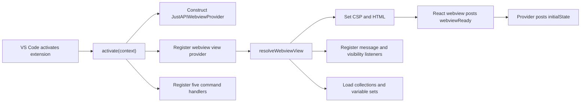
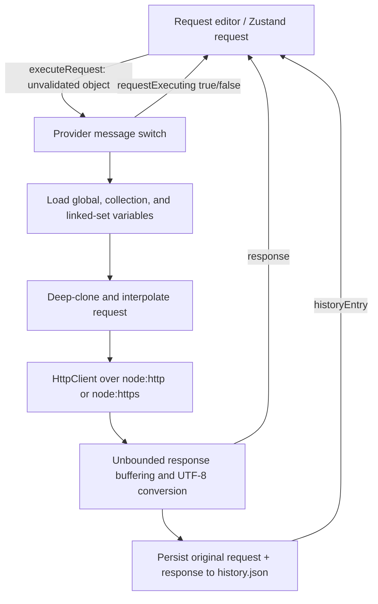

# JustAPI current-state architecture audit

Audit date: 2026-07-14<br>
Audited revision: `b21b04f1` (`main`, tracking `origin/main`)<br>
Audited manifest version: `1.0.1`<br>
Scope: factual baseline and architecture audit before production remediation

> **Document status (2026-07-20):** Sections below preserve the evidence captured at the
> pre-remediation revision. They are intentionally historical. The resolution index immediately
> below and the live [remediation ledger](./remediation-plan.md) record the stabilized state; the
> [closure report](./closure-report.md) records the completed final gate and release decision.

## Stabilization resolution index

The provider now acts as a VS Code composition/lifecycle root over a validated protocol router and
focused request, preparation, collection, history, persistence, and code-generation services. The
current module boundaries are documented in [`docs/architecture.md`](../architecture.md).

| Finding | Current status | Evidence / residual scope |
|---|---|---|
| JAPI-001 | Resolved | Auth Builder values use SecretStorage; persisted and derivative forms are redacted by default. Protected pre-auth migration backups remain an explicit rollback artifact. |
| JAPI-002 | Resolved | Schema-v2 atomic storage, locks, revision checks, verified backups, recovery, read-only failure states, and disposal flushing are covered by storage tests. |
| JAPI-003 | Resolved | Both protocol directions are runtime validated, bounded, acknowledged, and correlated by operation/execution IDs. |
| JAPI-004 | Resolved | cURL executable parsing, structured warnings, previews, and cancellation are covered by parser fixtures. Local-file references remain unsupported. |
| JAPI-005 | Resolved | One bounded resolver enforces Global < Set < Collection < Request and shares preflight across preview, transport, and code generation. |
| JAPI-006 | Resolved | Text-field multipart and URL-encoded bodies are byte-tested against the localhost fixture server. File-valued multipart is deferred. |
| JAPI-007 | Resolved | Response/redirect/decompression limits, cross-origin stripping, exact binary data, timings, and cancellation are covered by the localhost matrix. |
| JAPI-008 | Resolved | Collection mutations and recursive schema-v2 import/export validate and commit transactionally. Folder-management UI remains deferred. |
| JAPI-009 | Resolved | All seven commands are registered and use a ready-gated, one-shot startup-action queue with correlated outcomes. |
| JAPI-010 | Resolved | Layered unit, localhost integration, VS Code 1.80 extension-host, package, audit, and CI gates replace the placeholder assertion. |
| JAPI-011 | Resolved | History is a redacted summary store bounded to 200 entries and a 2 MiB envelope. |
| JAPI-012 | Resolved | Dependencies/generated output left the index; manifest/lock parity, audits, and package allowlisting are enforced. |
| JAPI-013 | Resolved | README/CHANGELOG distinguish verified behavior from deferred product gaps; claim trace, local links, package documentation, and the final Batch 5 gate passed. |
| JAPI-014 | Resolved | Stable-ID history mutation/replay and exact search navigation are covered by webview resilience tests. |
| JAPI-015 | Resolved | Text/JSON/tree presentation and exact raster images are bounded and tested. |
| JAPI-016 | Resolved | Seven normalized starter-snippet targets use placeholders by default, target-specific escaping, and parser/compiler checks. |
| JAPI-017 | Resolved | API-key header and query placement use SecretStorage-backed pre-transport resolution. |
| JAPI-018 | Resolved | Safe state restoration, dirty-navigation protection, TSX lint, keyboard semantics, focus management, and announcements are covered. |

Deferred capabilities are folder-management UI, request-variable editing, workspace-scoped storage,
cookie-jar persistence, proxies, client certificates/OAuth, local-file or streaming uploads, and
shell-compatible cURL/file expansion. No current documentation claims these are implemented.

## Executive summary

JustAPI has a compact, understandable architecture and its clean install, TypeScript checks, builds, placeholder extension-host test, and VSIX packaging all complete successfully. The package produced from the clean snapshot contains 11 files and is 97.43 KB. The project is not ready for correctness or security sign-off: the audit confirms 11 High, 6 Medium, and 1 Low findings. No finding met the threshold for Blocker or Critical.

The highest-risk root causes are:

1. secrets are copied into ordinary request headers and then persisted in collections, history, exports, and generated snippets;
2. the webview protocol trusts arbitrary runtime objects and has no operation/execution correlation;
3. persistence is delayed, non-atomic, non-versioned, and able to lose acknowledged writes silently;
4. the cURL importer stores `curl` as the URL, variable precedence is reversed, and multipart form bodies are not transmitted;
5. collection moves/imports/exports can orphan or omit data;
6. the only automated test is the generated sample assertion, so passing tests do not validate product behavior.

The next safe step is the board task **Create finding registry and remediation plan**. Production edits should remain blocked until that plan assigns each finding below to a coherent batch with a regression test and rollback strategy.

## Audit method and evidence rules

- **Confirmed** means source inspection plus a deterministic reproduction, build result, or direct end-to-end wiring trace establishes the behavior.
- **Probable** means the source path strongly implies the behavior but this audit did not execute the final UI or network edge.
- **Hypothesis** means investigation is still required. No hypothesis is used to justify a High severity.
- **Capability gap** means public or declared behavior lacks a complete user-reachable implementation; it is not automatically a defect in implemented behavior.
- Severity measures user/security/data impact, not implementation effort. There are no Blocker or Critical findings in this audit.

All command baselines were run from an isolated archive of `HEAD` under `/tmp/justapi-baseline.YnoNej`. This preserved the initial dirty working tree. The initial archive file was moved outside the snapshot before the authoritative VSIX packaging run, so it did not contaminate the final file list.

## Reproducible baseline

### Host and toolchain

| Item | Observed value | Evidence |
|---|---|---|
| OS | macOS 26.5, build 25F71 | `sw_vers` |
| Kernel / architecture | Darwin 25.5.0, arm64 | `uname -a` |
| Node.js | `v22.14.0` | `node --version` |
| npm | `10.9.2` | `npm --version` |
| Package manager | npm, lockfile v3 | `package-lock.json` |
| VS Code engine floor | `^1.80.0` | `package.json:22-24` |
| Test VS Code | `1.128.0` darwin-arm64 | `npm test` download/launch output |
| TypeScript | declared `^5.9.3`, installed `5.9.3` | `package.json:157`; `npm ls --depth=0` |
| webpack | declared `^5.105.3`, installed `5.106.2` | `package.json:159`; `npm ls --depth=0` |
| ESLint | declared `^9.39.3`, installed `9.39.4` | `package.json:153`; `npm ls --depth=0` |
| React / React DOM | declared `^19.0.0`, installed `19.2.6` | `package.json:138-141`; `npm ls --depth=0` |
| Zustand | declared `^5.0.0`, installed `5.0.13` | `package.json:141`; `npm ls --depth=0` |

The extension compiler targets Node16 modules and ES2022 with strict checking (`tsconfig.json:2-15`). The webview compiler targets ESNext/ES2022 with bundler resolution and strict checking (`webview-ui/tsconfig.json:2-13`). Root webpack builds both the Node extension host and browser webview; `vscode` remains external (`webpack.config.js:16-81`).

### Initial repository state

The following state was captured before production or documentation edits:

```text
## main...origin/main
 D justapi-0.0.1.vsix
?? .DS_Store
?? justapi-1.0.1.vsix
?? media/.DS_Store
?? node_modules/.DS_Store
?? node_modules/@azure/.DS_Store
?? out/.DS_Store
```

Those pre-existing changes were not altered. The repository measured 313 MB, including 256 MB under `node_modules`, 1.5 MB under `dist`, and 284 KB under `out`. Git tracks 21,016 paths; 20,901 are under `node_modules` (99.45% of tracked paths). Git object storage reported a 47.92 MiB pack. The last three commits were:

```text
b21b04f1 1.0.1 - Minor fix
72b8b681 API Extension
6442fff5 first commit
```

`.vscodeignore` correctly excludes dependencies, source, tests, maps, generated VSIX files, and development configuration from the extension package (`.vscodeignore:1-18`). There is no root `.gitignore`, which explains the tracked dependency tree and recurring OS/build artifacts.

The manifest is version `1.0.1`, while both the lockfile top-level version and `packages[""]` version remain `0.0.1`. The lockfile root also lists React, React DOM, and Zustand under both dependency classifications even though the manifest lists them only as runtime dependencies.

### Baseline command ledger

| Command | Exit | Result |
|---|---:|---|
| `npm ci` (restricted sandbox attempt) | 1 | Environmental `ENOTFOUND` for the npm registry; not a repository failure. |
| `npm ci` (network-enabled isolated snapshot) | 0 | Installed 620 packages; npm reported 10 vulnerabilities: 2 low, 3 moderate, 5 high. |
| `npm run lint` | 0 | 36 warnings, 0 errors. Only `src` is linted; warnings do not fail the command. |
| `npm run compile-tests` | 0 | Extension/test TypeScript emitted to `out`. |
| `./node_modules/.bin/tsc -p . --noEmit` | 0 | Extension-host strict type-check passed. |
| `./node_modules/.bin/tsc -p webview-ui/tsconfig.json --noEmit` | 0 | Webview strict type-check passed. |
| `npm run compile` | 0 | Development extension and webview bundles compiled. Webview bundle: 1.31 MiB. |
| `npm run package` | 0 | Production bundles compiled; webpack emitted three performance warnings for the 269 KiB webview bundle. |
| `npm test` | 0 | Pretest passed; VS Code 1.128.0 launched; one placeholder test passed. |
| `npm audit` | 1 | 10 advisories: 5 high, 3 moderate, 2 low, all in the development/tooling dependency graph reported by npm. |
| `npm run vsix` | 0 | Produced 11-file, 99,765-byte (`97.43 KB`) `justapi-1.0.1.vsix`. |

The packaged files are license, changelog, manifest, README, minified extension bundle, minified webview bundle plus its license file, and the two media assets. Source, tests, dependencies, caches, maps, and development configuration were absent.

## Current architecture

### Activation and lifecycle

`activate()` constructs one `JustAPIWebviewProvider`, registers it for `justapi.sidebar`, and registers commands (`src/extension.ts:5-20`). VS Code 1.74+ infers activation from the contributed webview and commands, so the absence of an explicit `activationEvents` array is not itself a defect at the declared engine floor.



The provider owns `HttpClient`, `CurlParser`, `VariableEngine`, `CollectionManager`, four `JsonFileStore` instances, `CodeGenerator` instances created per message, and `VariableSetManager` (`src/webview/JustAPIWebviewProvider.ts:20-42`). Deactivation calls only `httpClient.cancel()` (`src/webview/JustAPIWebviewProvider.ts:554-556`); it does not dispose/flush stores or explicitly dispose the message/visibility listeners. Store `dispose()` exists but is never called by production wiring (`src/storage/JsonFileStore.ts:79-85`).

### Extension-host services

| Service | Responsibility | State / side effects |
|---|---|---|
| `JustAPIWebviewProvider` | Composition root, message switch, request execution, history/settings/global-variable persistence, search, imports/exports, HTML/CSP | Holds the active view and all service instances. |
| `HttpClient` | Node `http`/`https` execution, redirects, timeout, response/cookie parsing | One mutable `AbortController`; no execution registry. |
| `CollectionManager` | In-memory collection tree and request map | Loads/saves one `collections.json` object. |
| `VariableEngine` | `{{name}}` interpolation and unresolved-name discovery | Stateless, but replacement loops are unbounded. |
| `VariableSetManager` | Variable-set CRUD and collection links | Loads/saves `variableSets.json`. |
| `CurlParser` | Tokenizes a cURL string into a request | Stateless. |
| `CodeGenerator` | Emits seven language snippets | Stateless; receives the full request including secrets. |
| `JsonFileStore` | JSON file cache and delayed writes | Synchronous filesystem calls behind async methods, 500 ms timer, no atomic replace or migration. |

### Webview state

React mounts one `App` with five Zustand stores:

| Store | State |
|---|---|
| `useRequestStore` | Current request and global `isExecuting` flag. |
| `useResponseStore` | Most recent response and presence flag. |
| `useCollectionStore` | Collections, active collection ID, selected request ID. |
| `useHistoryStore` | Entries and local filter text. |
| `useVariableStore` | Global variables, collection-variable map, and variable sets. |

`App` centrally consumes most host messages and posts initial/send/save/search messages (`webview-ui/src/App.tsx:49-137`). Component-local consumers also subscribe through a global handler set (`webview-ui/src/utils/vscodeApi.ts:24-37`). The wrapper exposes `getState`/`setState`, but production code never calls them (`webview-ui/src/utils/vscodeApi.ts:3-21`); editor/navigation state is therefore not restored after webview recreation.

### Persistence domains

All active production stores are rooted at `context.globalStorageUri.fsPath`; workspace storage exists as an unused factory (`src/storage/JsonFileStore.ts:18-25`).

| File key | Owner | Contents | Sensitive fields |
|---|---|---|---|
| `collections.json` | `CollectionManager` | Collections plus every saved request | Request headers/query/body, including auth values. |
| `variableSets.json` | `VariableSetManager` | Named variable sets and links | Variable values may be credentials. |
| `history.json` | Provider | Up to 200 full request/response pairs | Auth headers, request bodies, response bodies/cookies. |
| `globalVariables.json` | Provider | Global variables | Variable values may be credentials. |
| `settings.json` | Provider | Arbitrary settings object | Unvalidated arbitrary JSON. |

Writes update an in-memory cache and start a 500 ms timer (`src/storage/JsonFileStore.ts:42-53`). Reads ignore that cache and re-read disk (`src/storage/JsonFileStore.ts:27-40`). Flush uses direct `writeFileSync`, catches/logs errors, and clears all dirty keys even after failure (`src/storage/JsonFileStore.ts:56-73`). There is no schema version, migration, backup, temporary file, fsync, rename, interprocess lock, or recovery report.

### Request execution and data flow



The original request, not the resolved clone, is saved to history (`src/webview/JustAPIWebviewProvider.ts:362-379`), but auth values inserted by Auth Builder are already literal header/query values in that original request. HTTP response chunks have no size limit and are concatenated before UTF-8 conversion (`src/engine/http/HttpClient.ts:68-75`). Content encoding is not decompressed. Redirects recurse up to ten times, but relative locations are joined manually and the final response never reports a `finalUrl` (`src/engine/http/HttpClient.ts:49-65`, `106-118`).

## Webview protocol audit

Every row below has compile-time declaration only. The host callback accepts `any` and switches on `message.type` without a runtime guard (`src/webview/JustAPIWebviewProvider.ts:61-63`, `83-311`). There are no payload size/depth limits, operation IDs, execution IDs, acknowledgements, or correlated errors. Unknown types are silently ignored. The UI similarly trusts all `event.data` as `ExtensionMessage` (`webview-ui/src/utils/vscodeApi.ts:28-31`).

### Webview to extension host

| Message | UI sender / reachability | Host behavior | Response / error behavior |
|---|---|---|---|
| `executeRequest` | `App` send button | Resolves variables and executes | `requestExecuting`, `response`, optional `error`, `historyEntry`; no correlation. |
| `cancelRequest` | Request editor Cancel | Cancels the single client controller | Immediately posts `requestExecuting:false`; destroyed request may later emit an uncorrelated network response. |
| `saveRequest` | `App` save | Stores request and collection ref | Posts `collections`; UI shows success before acknowledgement. |
| `deleteRequest` | Collection request row | Deletes request map entry and one tree ref | Posts `collections`. |
| `getCollections` | No production sender | Returns in-memory collections | Posts `collections`. |
| `getRequest` | Collection request row | Looks up request by ID | Posts `requestLoaded` only when found; otherwise silent. |
| `createCollection` | Collection panel | Creates collection | Posts `collections`. |
| `updateCollection` | Collection-variable editor | Replaces collection object | Posts `collections`. |
| `deleteCollection` | Collection panel | Removes collection only | Posts `collections`; orphan requests remain in storage. |
| `duplicateCollection` | Collection panel | Deep-copies tree and referenced requests | Posts `collections`. |
| `renameCollection` | Collection panel | Mutates matching collection name | Posts `collections`; missing ID is silent. |
| `moveItem` | No production sender | Extracts source item, then attempts destination insert | Posts `collections`; failed destination can lose the extracted item. |
| `getHistory` | History panel | Reads, filters, sorts, limits | Posts `history`. |
| `clearHistory` | History panel | Schedules empty history write | Posts empty `history`. |
| `deleteHistoryEntry` | History row | Filters and writes history | No response; UI remains stale. |
| `getVariables` | No production sender | Reads globals | Posts `variables`. |
| `setGlobalVariables` | Variable editor | Schedules globals write | No acknowledgement. |
| `setCollectionVariables` | No sender | **Declared but unhandled** | Silent. |
| `getSettings` | No production sender | Reads settings | Posts `settings`. |
| `setSettings` | No production sender | Schedules arbitrary settings write | No acknowledgement. |
| `search` | Global search bar | Searches collection tree and history | Posts `searchResults`. |
| `importCurl` | No webview sender; command calls provider directly | Parses cURL | Posts `curlImportResult` or generic `error`. |
| `exportCollection` | No production sender; contributed command only opens view | Opens JSON text document | No protocol response. Nested request export is incomplete. |
| `importCollection` | No production sender; contributed command is unregistered | Parses and imports unvalidated JSON | Posts `collections` or `IMPORT_ERROR`. |
| `generateCode` | Code panel | Generates from full request | Posts `codeGenerationResult`; unsupported language is returned as comment. |
| `getWorkspaceCollections` | No sender | **Declared but unhandled** | Silent. |
| `setWorkspaceEnabled` | No sender | **Declared but unhandled** | Silent. |
| `webviewReady` | `App` startup | Reloads all stores | Posts `initialState`. |
| `previewResolution` | Active variables panel | Resolves URL, enabled headers, body | Posts `resolutionPreview`. |
| `getVariableSets` | Variable-set panel | Returns in-memory sets | Posts `variableSets`. |
| `createVariableSet` | Variable-set panel | Creates and persists set | Posts `variableSets` twice via callback plus explicit response. |
| `updateVariableSet` | Variable-set panel | Replaces and persists set | Posts `variableSets` twice. |
| `deleteVariableSet` | Variable-set panel | Deletes and persists set | Posts `variableSets` twice. |
| `linkVariableSet` | Collection/set panels | Adds collection link | Posts `variableSets` twice. |
| `unlinkVariableSet` | Collection/set panels | Removes collection link | Posts `variableSets` twice. |

### Extension host to webview

| Message | Host producer | UI consumer | Notes |
|---|---|---|---|
| `collections` | Collection changes/queries | `App` | Uncorrelated full replacement. |
| `collection` | **Never produced** | **No consumer** | Dead declared variant. |
| `requestLoaded` | `getRequest` | `App` | No requested ID echoed. |
| `history` | get/clear history | `App` | No query/filter ID. |
| `historyEntry` | successful request history save | `App` | Contains full request and response. |
| `response` | request execution | `App` | No execution ID; stale results can overwrite newer ones. |
| `variables` | `getVariables` | `App` | No request ID. |
| `collectionVariables` | **Never produced** | **No consumer** | Dead declared variant. |
| `settings` | `getSettings` | **No consumer** | Produced but ignored. |
| `searchResults` | search | `App` | No operation ID; delayed results can replace newer search state. |
| `curlImportResult` | import message/command | `App` | No operation ID. |
| `codeGenerationResult` | code generation | `App` | No operation ID. |
| `error` | catch/import/unresolved/cURL command | `App` toast | Usually has no stable code and can expose raw exception text. |
| `workspaceEnabled` | **Never produced** | **No consumer** | Dead declared variant. |
| `requestExecuting` | execute/cancel | `App` | One global boolean, not per execution. |
| `initialState` | webview ready | `App` | Full unversioned state snapshot. |
| `variableSets` | set CRUD/link/query/change callback | `App` and set panel | Duplicate deliveries are common. |
| `variableSetUpdated` | **Never produced** | **No consumer** | Dead declared variant. |
| `resolutionPreview` | preview | `App` to event bus | No operation ID. |
| `createNewRequest` | command | `App` | Dropped when command fires before the view resolves. |

## Public feature verification

This matrix covers the feature and command claims in `README.md:9-118` and `CHANGELOG.md:5-27`.

| Public claim | Status | Evidence |
|---|---|---|
| GET/POST/PUT/PATCH/DELETE/OPTIONS/HEAD | Implemented | Request type enumerates all methods; transport forwards the selected method (`src/models/Request.ts:4`, `HttpClient.ts:35-43`). |
| Redirect following | Partial / defective | Recursion exists, but relative resolution and final metadata are incorrect; compression/body cleanup is absent. |
| SSL verification toggle | Implemented | `rejectUnauthorized` comes from request settings (`HttpClient.ts:35-43`). |
| Per-request timeout | Implemented | Node request timeout resolves a typed timeout response (`HttpClient.ts:122-139`). |
| Content-Type auto-detection | Partial | JSON/form/text/XML mappings exist; multipart omits its required boundary header. |
| Response timing | Implemented | Duration uses `performance.now()` (`HttpClient.ts:26`, `72`, `124`). |
| Error classification | Partial | DNS/SSL/timeout/network are classified; cancellation becomes a generic network error. |
| Nested folders | Capability gap | Model/recursive rendering and unused manager method exist, but there is no UI/protocol action to create a folder. |
| Collection duplicate/rename/move/full CRUD | Partial / overclaimed | Collection duplicate/rename/delete exist; no UI sends `moveItem`; folder rename/delete/create are absent. |
| Collection import/export | Capability gap / defective | Host handlers exist but commands do not initiate them; import command is unregistered; nested requests are omitted by export. |
| Paste any cURL command | Defective | Deterministic reproduction stores literal `curl` as the URL. Supported option set is narrow and unknown options are silent. |
| Four variable scopes with Global < Set < Collection < Request | Defective | Runtime replacement processes global first, so global wins; request variables have no editing UI. |
| Variable sets | Implemented with persistence risk | CRUD/link UI and manager exist. |
| Scope-aware autocomplete | Implemented | Autocomplete combines request/collection/set/global sources (`VariableAutocomplete.tsx:53` and surrounding logic). |
| Variable syntax highlighting | Implemented in principal request inputs | URL/body/header values use highlighted inputs; “all text inputs” is broader than actual wiring. |
| Variable conflict warnings | Implemented in active-variable panel | Duplicate-name detection and badges exist (`ActiveVariablesPanel.tsx:77-88`, `281-289`). |
| Bearer and Basic authentication | Implemented insecurely | Builder creates literal Authorization headers that ordinary persistence retains. |
| API key in custom header or query | Partial / defective | Header path works; selecting query causes `applyAuth` to add neither header nor query parameter (`RequestEditor.tsx:320-352`). |
| Status/timing/size response summary | Implemented | Response viewer consumes transport metadata. |
| JSON tree and raw/pretty views | Implemented, unbounded | Full body is parsed/formatted on the UI thread. |
| XML formatting | Partial | A simple indentation formatter exists; no XML parser/validation. |
| Inline image rendering | Defective | Binary was already UTF-8 decoded, then `btoa` is applied with wildcard MIME (`ResponseViewer.tsx:489-493`). |
| Headers and Set-Cookie inspection | Implemented | Transport parses headers/cookies; viewer renders both. |
| Response search and copy | Implemented | Viewer has local highlight search and clipboard action. |
| History newest-first/filter/cap | Implemented with durability/size risks | Sort/filter and 200-count cap exist; entries include unbounded full responses. |
| History replay | Partial | Click updates request state but leaves the History tab active. |
| Seven production-ready code generators | Defective / overclaimed | Seven selectors exist, but C# and multi-header Java output can be invalid and secrets are embedded. Treat as starter snippets. |
| Global search across collections/folders/requests/history | Partial | Search finds them, but selection does not load a request; history results have no actionable collection ID (`App.tsx:174-185`). |
| Slide-down toast notifications | Implemented | `App` notification state and animation are wired. |
| Seven Command Palette commands | Declared, not implemented end-to-end | Only five are registered; import and code generation are missing, while export/history/variable handlers only open the view. |
| Two keyboard shortcuts | Declared | Both contributions exist, but startup messages may be dropped before view resolution. |
| Local-first / no telemetry / no account | Largely supported | No telemetry/account integration was found; persistent data uses global local storage. User-selected HTTP requests intentionally send request data to their targets. |

## Findings

### JAPI-001 — Secrets are persisted and reproduced as ordinary request data

- **Severity:** High
- **Status:** Confirmed security defect
- **Confidence:** High
- **Evidence:** Auth Builder converts bearer/basic/API-key credentials to literal request headers (`RequestEditor.tsx:285-352`). Saved collections persist the full request (`CollectionManager.ts:118-142`); successful history persists the full original request and response (`JustAPIWebviewProvider.ts:429-450`); export and code generation consume those same objects (`JustAPIWebviewProvider.ts:205-239`). `JsonFileStore` writes plaintext JSON (`JsonFileStore.ts:56-67`).
- **Reproduction:** Configure Bearer auth, click Apply, then save or execute. The token becomes the `Authorization` header in `collections.json` and/or `history.json`; generated snippets include it verbatim.
- **Classification:** Security bug, not a capability gap.

### JAPI-002 — Persistence can lose acknowledged writes and cannot recover safely

- **Severity:** High
- **Status:** Confirmed data-integrity defect
- **Confidence:** High
- **Evidence:** Writes are delayed 500 ms; reads bypass the dirty cache; flush writes the target directly; errors are only logged; dirty keys are cleared even after failure (`JsonFileStore.ts:27-73`). Provider disposal never disposes stores (`JustAPIWebviewProvider.ts:554-556`). No version, backup, migration, atomic rename, or lock exists.
- **Reproduction:** Trigger two history read-modify-write operations inside the 500 ms window. The second read sees the old disk file, replaces the dirty cached array, and can discard the first entry. Closing/deactivating before the timer fires can also leave the acknowledged save unflushed.
- **Classification:** Correctness/data-loss bug.

### JAPI-003 — Webview messages are unvalidated and uncorrelated

- **Severity:** High
- **Status:** Confirmed security and correctness defect
- **Confidence:** High
- **Evidence:** Host listener accepts `any` and directly dereferences fields (`JustAPIWebviewProvider.ts:61-63`, `83-304`). UI trusts `event.data` (`vscodeApi.ts:28-31`). No message contains `operationId` or `executionId` (`MessageProtocol.ts:8-67`). Unknown variants are silent.
- **Reproduction:** Post `{type:'deleteCollection', collectionId:{}}` or a deeply nested/oversized import object from webview developer tools; it reaches business logic without a guard. Send two requests quickly; either untagged response may replace the current UI response.
- **Classification:** Security boundary and race bug.

### JAPI-004 — The cURL parser assigns the literal word `curl` as the URL

- **Severity:** High
- **Status:** Confirmed functional defect
- **Confidence:** High
- **Evidence:** Token scanning begins at index 0 and treats the first non-option token as the URL (`CurlParser.ts:15-20`, `92-95`).
- **Reproduction:** `node -e "const {CurlParser}=require('./out/engine/http/CurlParser'); console.log(new CurlParser().parse('curl https://example.com').url)"` prints `curl`.
- **Classification:** Functional bug.

### JAPI-005 — Variable precedence is reversed and replacement can loop forever

- **Severity:** High
- **Status:** Confirmed correctness/availability defect
- **Confidence:** High
- **Evidence:** The engine concatenates global, set, collection, request variables and immediately replaces all matches for each entry (`VariableEngine.ts:16-29`). The first/global value removes the placeholder before higher-priority entries run. `while (result.includes(pattern))` is unbounded when a value contains its own placeholder.
- **Reproduction:** Resolving `{{token}}` with values `global`, `set`, `collection`, and `request` prints `global`. A variable `x={{x}}` never makes progress in the replacement loop.
- **Classification:** Functional and availability bug.

### JAPI-006 — Multipart form-data requests send no body

- **Severity:** High
- **Status:** Confirmed transport defect
- **Confidence:** High
- **Evidence:** `buildBody` returns early whenever `content` is empty, before it examines `formData` (`HttpClient.ts:237-249`). UI form rows populate `formData`, not `content`. Even when forced past the early return, `buildHeaders` intentionally adds no multipart Content-Type/boundary (`HttpClient.ts:211-234`).
- **Reproduction:** Calling `buildBody({type:'form-data', content:'', formData:[...]})` returns `undefined`; `buildHeaders` returns `{}`.
- **Classification:** Functional bug.

### JAPI-007 — HTTP response handling is unbounded and redirect/cancel metadata is unreliable

- **Severity:** High
- **Status:** Confirmed transport defect
- **Confidence:** High
- **Evidence:** Every response chunk is buffered without a byte limit, concatenated, and decoded as UTF-8 (`HttpClient.ts:68-75`). There is no content-encoding decompression. Relative redirects are manually joined; final responses set `finalUrl:undefined`, and cancellation destroys the request but is classified by the generic error listener (`HttpClient.ts:49-65`, `106-178`).
- **Reproduction:** A large or endless response grows extension-host memory. A `Location: ../next` or query-only location is resolved incorrectly. Cancel an execution and observe an uncorrelated network-style result after the UI has already set executing false.
- **Classification:** Correctness, availability, and UX bug.

### JAPI-008 — Collection operations can orphan, drop, overwrite, or omit data

- **Severity:** High
- **Status:** Confirmed data-integrity defect
- **Confidence:** High
- **Evidence:** Delete collection retains its requests (`CollectionManager.ts:68-75`). Save inserts into the request map before validating collection/parent (`118-140`). Move extracts before checking destination insertion and ignores `addToFolder` failure (`155-177`). Import accepts colliding unvalidated IDs (`203-211`). Export maps only top-level items (`JustAPIWebviewProvider.ts:205-213`).
- **Reproduction:** Move an item to a missing `targetParentId`; it is removed from the source and not inserted. Export a collection whose requests are nested; the exported `requests` array omits them. Import duplicate request IDs; later map entries overwrite earlier requests.
- **Classification:** Data-loss/correctness bug.

### JAPI-009 — Command contributions are incomplete and startup actions are racy

- **Severity:** High
- **Status:** Confirmed functional defect
- **Confidence:** High
- **Evidence:** Manifest contributes seven commands (`package.json:57-85`), while `registerCommands` registers five (`registerCommands.ts:11-39`). Import Collection and Generate Code are absent. Export, Open History, and Create Variable only open the container. New Request and cURL execute the open command without awaiting view resolution, then post through an optional `view` (`registerCommands.ts:12-38`; provider `postMessage` at `558-560`).
- **Reproduction:** Invoke Import Collection or Generate Code from the Command Palette: VS Code has a contribution but no registered implementation. Invoke New Request before the view resolves: `postMessage` is a no-op and the startup action is lost.
- **Classification:** Functional bug/capability gap.

### JAPI-010 — Automated validation provides no product regression coverage

- **Severity:** High
- **Status:** Confirmed quality-system gap
- **Confidence:** High
- **Evidence:** The sole test asserts `indexOf` returns `-1` (`src/test/extension.test.ts:8-14`). No tests cover transport, variables, persistence, protocol, collections, cURL, generation, commands, security, or UI. `npm test` reports one passing sample test.
- **Reproduction:** Introduce a defect in any product service; the current test remains green unless compilation fails.
- **Classification:** Architectural debt that blocks safe remediation.

### JAPI-011 — History retention exposes secrets and has no byte bound

- **Severity:** High
- **Status:** Confirmed security/availability defect
- **Confidence:** High
- **Evidence:** Each entry embeds full request and response (`HistoryEntry.ts:4-13`; provider `429-449`). The cap is 200 entries by count only. Response bodies are unbounded, and cookies/auth headers are retained.
- **Reproduction:** Execute 200 requests returning large bodies; `history.json` grows by the total response size and contains credential material from each request.
- **Classification:** Security, privacy, and storage bug.

### JAPI-012 — Repository and lockfile state are not maintainable or version-consistent

- **Severity:** Medium
- **Status:** Confirmed infrastructure defect
- **Confidence:** High
- **Evidence:** 20,901 tracked `node_modules` paths, no root `.gitignore`, 313 MB working tree, and lockfile root version `0.0.1` versus manifest `1.0.1`. `npm audit` reports 10 advisories in tooling dependencies.
- **Reproduction:** `git ls-files node_modules | wc -l` prints `20901`; compare `package.json:5` with `package-lock.json` root metadata.
- **Classification:** Infrastructure/dependency debt.

### JAPI-013 — Collection and cURL public claims exceed user-reachable behavior

- **Severity:** Medium
- **Status:** Confirmed capability gap
- **Confidence:** High
- **Evidence:** README claims nested-folder creation, full CRUD/move, import/export, and any cURL command (`README.md:22-30`). No folder-create protocol/UI exists; no UI sends move/import/export; command wiring is incomplete; cURL URL parsing is broken.
- **Reproduction:** Inspect the Collections panel: it can create collections and render existing folders but cannot create/rename/delete/move folders or move requests. Invoke documented import/export commands and compare behavior to the claim.
- **Classification:** Capability/documentation gap.

### JAPI-014 — History deletion and global-search selection leave stale or incomplete UI state

- **Severity:** Medium
- **Status:** Confirmed UX defect
- **Confidence:** High
- **Evidence:** Delete history writes but posts no updated list (`JustAPIWebviewProvider.ts:458-462`); UI does not remove locally (`HistoryPanel.tsx:24-26`). Search selection only selects a collection and opens the Collections tab; it never requests the selected request, and history results have no collection ID (`App.tsx:174-185`).
- **Reproduction:** Delete a history row; it remains visible until a later reload. Select a search result; request content is not loaded into the editor.
- **Classification:** Functional/UX bug.

### JAPI-015 — Binary/image and large structured responses are rendered unsafely

- **Severity:** Medium
- **Status:** Confirmed correctness/performance defect
- **Confidence:** High
- **Evidence:** Transport converts every body to UTF-8 string before type-aware rendering (`HttpClient.ts:73-75`). Image rendering calls `btoa(body)` and labels it `image/*` (`ResponseViewer.tsx:489-493`). JSON tree/pretty rendering parses/stringifies the complete body synchronously (`ResponseViewer.tsx:509-537`).
- **Reproduction:** Return non-UTF-8 image bytes; the string/base64 round trip changes data or throws for unsupported characters. Open a very large JSON response; parsing and tree rendering block the webview.
- **Classification:** Correctness/performance bug.

### JAPI-016 — Generated snippets can be invalid and expose credentials

- **Severity:** Medium
- **Status:** Confirmed functional/security defect
- **Confidence:** High
- **Evidence:** C# emits single-quoted strings for `StringContent` (`CodeGenerator.ts:175-184`). Java repeats an unterminated `var requestBuilder` declaration for each enabled header (`221-249`). All generators copy literal headers/body values.
- **Reproduction:** Generate C# for a JSON body: output contains `new StringContent('{...}')`, which is invalid C#. Generate Java with two headers: output contains repeated `var requestBuilder` declarations without statement terminators. Generate any snippet after applying auth: the secret is embedded.
- **Classification:** Functional and secret-disclosure bug.

### JAPI-017 — API-key query mode is displayed but does nothing

- **Severity:** Medium
- **Status:** Confirmed functional defect
- **Confidence:** High
- **Evidence:** UI offers Header and Query param radio buttons (`RequestEditor.tsx:440-468`), but `applyAuth` only handles `apiKeyIn === 'header'` and never edits query parameters (`320-352`).
- **Reproduction:** Choose API Key, select Query param, enter name/value, and click Apply. Neither headers nor query parameters change.
- **Classification:** Functional bug.

### JAPI-018 — Webview state, lint coverage, and accessibility checks are incomplete

- **Severity:** Low
- **Status:** Confirmed architectural debt
- **Confidence:** High
- **Evidence:** VS Code state methods are exposed but unused (`vscodeApi.ts:3-21`). ESLint config matches `.ts` only and the script targets `src` (`eslint.config.mjs:3-5`; `package.json:135`), so TSX is not linted. UI uses many clickable `div`/`span` elements without keyboard semantics, while no accessibility test exists.
- **Reproduction:** Recreate the webview and observe navigation/editor state reset. Add a lint violation to a TSX component; `npm run lint` does not report it. Navigate collection folders/search results using only the keyboard.
- **Classification:** UX/testability debt.

## Finding registry summary

| ID | Severity | Type | Primary owner task |
|---|---|---|---|
| JAPI-001 | High | Secrets/redaction | Migrate authentication secrets and redact derivative artifacts |
| JAPI-002 | High | Persistence/data loss | Introduce versioned atomic persistence and recovery |
| JAPI-003 | High | Protocol/security/races | Validate and correlate the webview message protocol |
| JAPI-004 | High | cURL correctness | Repair cURL parsing and unsupported-option reporting |
| JAPI-005 | High | Variable correctness/DoS | Make variable resolution deterministic, bounded, and consistent |
| JAPI-006 | High | HTTP multipart | Correct and harden the HTTP transport |
| JAPI-007 | High | HTTP limits/redirect/cancel | Correct and harden the HTTP transport |
| JAPI-008 | High | Collection integrity | Protect collection tree integrity and import/export round trips |
| JAPI-009 | High | Commands/startup | Wire every contributed command and webview startup action |
| JAPI-010 | High | Test harness | Build automated validation harness and CI |
| JAPI-011 | High | History security/limits | Persistence + auth/redaction + webview stabilization |
| JAPI-012 | Medium | Repository/dependencies | Clean repository dependencies and delivery artifacts |
| JAPI-013 | Medium | Capability/docs | Correct public claims and document deferred capability gaps |
| JAPI-014 | Medium | History/search UX | Stabilize webview state, history, search, responses, and accessibility |
| JAPI-015 | Medium | Response correctness/perf | HTTP hardening + webview stabilization |
| JAPI-016 | Medium | Code generation | Generate valid normalized secret-aware code snippets |
| JAPI-017 | Medium | Auth UI | Auth migration + webview stabilization |
| JAPI-018 | Low | State/lint/accessibility debt | Validation harness + webview stabilization |

## Review and completeness check

- All findings point to source, command output, or deterministic reproduction; no documentation claim was accepted as implementation evidence.
- No severity was promoted to Blocker or Critical. High findings are limited to credential exposure, silent data loss, untrusted boundary handling, broken core request transformations/transports, and the absence of regression protection for those paths.
- Duplicate symptoms are grouped under root causes: history loss is under persistence; stale request results are under protocol correlation; nested export/orphans/move loss are under collection integrity.
- Audited subsystems: activation, manifest commands/views/keybindings, provider lifecycle, protocol in both directions, React/Zustand stores, persistence, collection/import/export, variables/sets, cURL, HTTP, history, search, response rendering, authentication, code generation, TypeScript/ESLint/webpack/test configuration, dependency state, and VSIX contents.
- Runtime coverage in this baseline is limited to compilation, a real VS Code extension-host launch, the placeholder test, and deterministic Node reproductions. There is no existing automated UI smoke harness; interactive UI/network smoke coverage belongs to the validation-harness and final-validation tasks.

## Exit decision

The current-state audit task is complete. The repository can build and package, but it is **not ready for a production stabilization sign-off**. The evidence is sufficient to create the decision-complete remediation plan without making speculative production changes.
