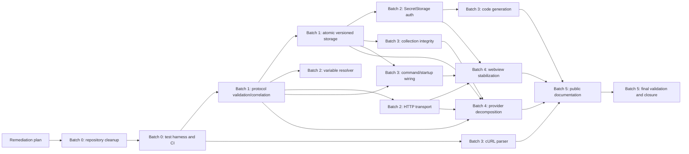

# JustAPI remediation plan and execution ledger

Plan date: 2026-07-14<br>
Source audit: [`current-state-audit.md`](./current-state-audit.md)<br>
Audited revision: `b21b04f1` on `main`<br>
Plan status: Batches 0–4 passed; Batch 5 documentation owner complete and final validation pending<br>
Scope: stabilization and evidence-backed remediation only

## Decision summary

The current-state audit found **11 High, 6 Medium, and 1 Low** findings. It found no Blocker or Critical issue, so this plan does not promote any finding to those severities. The extension builds and packages, but passing validation currently has little product meaning because the only automated test is a placeholder.

Implementation is divided into Batch 0 through Batch 5. Each batch has an explicit entry gate, one or more Lynvo owner tasks, targeted regression tests, a full-suite gate, rollback instructions, and an execution-ledger row. Production behavior must not be edited before this plan is complete. After implementation begins, update this document at the end of every batch with the actual commands, results, deviations, residual risks, and commit or patch reference.

Approved product decisions inherited from the master roadmap:

- recognized Auth Builder credentials migrate to VS Code `SecretStorage`;
- tracked dependencies and generated artifacts leave the Git index while `package-lock.json` remains the reproducible dependency source;
- substantial unsupported capabilities are documented and deferred instead of being added during stabilization;
- history becomes a bounded, secret-free summary store rather than a full request/response archive;
- no Blocker, Critical, or High finding may remain unaccepted at closure.

## Baseline and architecture summary

The repository is a VS Code webview extension with a single composition-heavy `JustAPIWebviewProvider`. React and five Zustand stores run in the webview. The extension host owns HTTP execution, collection management, variables, cURL parsing, code generation, and several JSON stores rooted in VS Code global storage.

The baseline passed clean installation, extension and webview type-checking, development and production builds, the placeholder extension-host test, and VSIX packaging. Lint exited successfully with 36 warnings. `npm audit` exited 1 with 10 development/tooling advisories. The authoritative VSIX contained 11 files and measured 97.43 KB.

Repository and runtime constraints that drive the sequence:

- 20,901 tracked paths are under `node_modules`; the lockfile root version is `0.0.1` while the manifest is `1.0.1`.
- The current test suite cannot protect behavior, so repository cleanup and a deterministic harness precede correctness edits.
- The webview protocol accepts `any`, has no runtime limits, acknowledgements, operation IDs, or execution IDs.
- Persistence uses delayed direct writes, reads past dirty cache state, suppresses write failures, and has no schema or recovery.
- Auth secrets are ordinary request values and flow into storage, history, exports, and generated snippets.
- Request execution, preview, code generation, and import paths normalize data independently and can disagree.
- The provider owns too many business rules, but structural extraction waits until correctness is protected by tests.

## Task key

| Key | Lynvo task ID | Task |
|---|---|---|
| REPO | `task-mrjk92hr-1lc2gkgb` | Clean repository dependencies and delivery artifacts |
| TEST | `task-mrjk92hs-gvq9eeb7` | Build automated validation harness and CI |
| PROTOCOL | `task-mrjk92ht-1v9vmvhg` | Validate and correlate the webview message protocol |
| STORAGE | `task-mrjk92hu-l37yy8ky` | Introduce versioned atomic persistence and recovery |
| AUTH | `task-mrjk92hv-p5v3ykrx` | Migrate authentication secrets and redact derivative artifacts |
| VARIABLES | `task-mrjk92hw-3ra0l6c5` | Make variable resolution deterministic, bounded, and consistent |
| HTTP | `task-mrjk92hx-m3m57qoh` | Correct and harden the HTTP transport |
| COLLECTIONS | `task-mrjk92hy-tzv9jeql` | Protect collection tree integrity and import/export round trips |
| CURL | `task-mrjk92hz-hkmxzgl8` | Repair cURL parsing and unsupported-option reporting |
| CODEGEN | `task-mrjk92i0-zidiwkfc` | Generate valid normalized secret-aware code snippets |
| COMMANDS | `task-mrjk92i1-8xlz99cv` | Wire every contributed command and webview startup action |
| UI | `task-mrjk92i2-mi3if49a` | Stabilize webview state, history, search, responses, and accessibility |
| REFACTOR | `task-mrjk92i3-sr46q2x6` | Decompose the webview provider into testable services |
| DOCS | `task-mrjk92i4-k3xayiqc` | Correct public claims and document deferred capability gaps |
| FINAL | `task-mrjk92i5-pbs05wwz` | Run final validation, smoke tests, and closure report |

## Prioritized finding registry

Every finding has exactly one primary owner. Supporting tasks may provide prerequisites, but the owner is responsible for the completion signal and for updating the finding status in this ledger.

| Priority | Finding | Severity | Justification | Batch | Primary owner | Required predecessors |
|---:|---|---|---|---:|---|---|
| 1 | JAPI-010 — No product regression coverage | High | All later fixes are unsafe without deterministic tests. | 0 | TEST | REPO |
| 2 | JAPI-003 — Unvalidated, uncorrelated protocol | High | Untrusted messages can mutate state; races affect every UI operation. | 1 | PROTOCOL | TEST |
| 3 | JAPI-002 — Persistence can lose writes | High | Silent loss/corruption must be fixed before data or secret migration. | 1 | STORAGE | TEST, PROTOCOL |
| 4 | JAPI-001 — Secrets persisted as request data | High | Credentials currently reach disk and derivative artifacts. | 2 | AUTH | TEST, PROTOCOL, STORAGE |
| 5 | JAPI-011 — History stores secrets and unbounded bodies | High | Security, privacy, and storage exhaustion risk. | 1 | STORAGE | TEST, PROTOCOL |
| 6 | JAPI-005 — Reversed/unbounded variable resolution | High | Wrong requests and self-reference hangs occur before network I/O. | 2 | VARIABLES | TEST, PROTOCOL |
| 7 | JAPI-006 — Multipart bodies are not sent | High | A documented core body mode is nonfunctional. | 2 | HTTP | TEST, PROTOCOL |
| 8 | JAPI-007 — Unbounded/incorrect HTTP handling | High | Memory, cancellation, redirect, decoding, and metadata failures. | 2 | HTTP | TEST, PROTOCOL |
| 9 | JAPI-008 — Collection mutations can lose/omit data | High | Failed moves/imports/exports can corrupt user-owned trees. | 3 | COLLECTIONS | TEST, STORAGE |
| 10 | JAPI-004 — cURL executable parsed as URL | High | The primary import flow produces an invalid request. | 3 | CURL | TEST |
| 11 | JAPI-009 — Commands incomplete and racy | High | Advertised commands are missing, inert, or drop cold-start actions. | 3 | COMMANDS | PROTOCOL, STORAGE |
| 12 | JAPI-012 — Repository/lockfile inconsistency | Medium | Tracked dependencies and stale metadata impede reproducibility. | 0 | REPO | This plan |
| 13 | JAPI-016 — Invalid, secret-bearing snippets | Medium | Output can fail to compile and disclose credentials. | 3 | CODEGEN | TEST, AUTH |
| 14 | JAPI-017 — API-key query mode is inert | Medium | UI offers a path that changes no request data. | 2 | AUTH | PROTOCOL, STORAGE |
| 15 | JAPI-015 — Unsafe binary/large response rendering | Medium | Bytes are corrupted and large parsing can freeze the webview. | 4 | UI | HTTP, PROTOCOL |
| 16 | JAPI-014 — Stale history/search UI | Medium | Common navigation and deletion flows do not reflect actual state. | 4 | UI | PROTOCOL, COMMANDS |
| 17 | JAPI-013 — Public claims exceed behavior | Medium | Users are promised unavailable or defective behavior. | 5 | DOCS | CURL, CODEGEN, UI, REFACTOR |
| 18 | JAPI-018 — State/lint/accessibility debt | Low | Reload and keyboard behavior are weak; TSX escapes lint. | 4 | UI | TEST, PROTOCOL |

## Dependency graph



Parallel work is allowed only within a batch after all arrows entering that task are complete. A task cannot be marked Done because a supporting task changed its files; its own regression contract and completion signal must pass.

## Batch overview

| Batch | Objective | Owner tasks | Findings closed | Entry gate | Exit gate |
|---:|---|---|---|---|---|
| 0 | Reproducible repository and safety net | REPO, TEST | JAPI-010, JAPI-012; lint portion of JAPI-018 | Plan approved | Clean install, deterministic tests/CI, clean VSIX, audit decision recorded |
| 1 | Trusted boundary and durable storage | PROTOCOL, STORAGE | JAPI-002, JAPI-003, JAPI-011 | Batch 0 green | Malformed/race tests and migration/recovery tests green; no silent writes |
| 2 | Secret-safe request preparation and transport | AUTH, VARIABLES, HTTP | JAPI-001, JAPI-005, JAPI-006, JAPI-007, JAPI-017 | Batch 1 green | Preflight/execution parity, secret redaction, local HTTP matrix green |
| 3 | Transactional data flows and usable commands | COLLECTIONS, CURL, CODEGEN, COMMANDS | JAPI-004, JAPI-008, JAPI-009, JAPI-016 | Required Batch 2 owners green | Round trips, parser fixtures, snippet checks, cold/warm commands green |
| 4 | Resilient UI and maintainable provider | UI, REFACTOR | JAPI-014, JAPI-015, JAPI-018 | Batch 3 green | Reload/race/binary/a11y smoke green; provider boundaries documented/tested |
| 5 | Accurate documentation and release decision | DOCS, FINAL | JAPI-013 and registry closure | Batch 4 green | Clean full gate, smoke matrix, artifact inspection, closure report |

Batch boundaries are engineering gates, not release candidates. No VSIX produced during Batch 0 through Batch 4 may be published or distributed as a stabilized release. In particular, Batch 1 may wrap legacy collection requests in v2 storage while their existing auth headers remain unchanged; Batch 2 must complete the SecretStorage migration and recursive redaction scan before any build leaves the development environment. Batch 1 still removes full bodies/credentials from history immediately and must not create a new secret-bearing derivative path.

## Finding delivery contracts

### JAPI-001 — Secrets are persisted and reproduced as ordinary request data

- **Owner / batch / effort:** AUTH / Batch 2 / Large.
- **Smallest coherent fix:** introduce persisted `AuthConfig` metadata plus opaque secret references; migrate only recognized Auth Builder credentials; resolve values immediately before transport; redact every non-transport representation.
- **Expected files:** `src/models/Request.ts`, new `src/engine/auth/*`, `src/webview/JustAPIWebviewProvider.ts` or extracted request service, `webview-ui/src/components/RequestEditor/RequestEditor.tsx`, collection/history/export/code-generation boundaries, auth/storage tests.
- **Required regression:** bearer, UTF-8 basic, exact `X-API-Key` header, API-key query, legacy migration, duplicate/delete cleanup, redacted protocol/history/export/codegen, explicit one-shot reveal.
- **Completion signal:** a recursive scan of storage fixtures, messages, logs, exports, history, and default snippets finds no credential value; transport still receives the correct value from `SecretStorage`.

### JAPI-002 — Persistence can lose acknowledged writes and cannot recover safely

- **Owner / batch / effort:** STORAGE / Batch 1 / Large.
- **Smallest coherent fix:** replace delayed direct writes with versioned envelopes, a serialized queue, exclusive lock plus revision check, same-directory temp write, fsync, atomic rename, backups, quarantine, and visible read-only failure.
- **Expected files:** replace or split `src/storage/JsonFileStore.ts` into `src/storage/*`; `src/extension.ts`; provider disposal/composition; persistence models; migration/recovery fixtures and tests.
- **Required regression:** two writes inside 500 ms, two simulated windows, stale revision, interrupted temp write, malformed JSON, unsupported schema, failed migration, verified backup restore, shutdown flush.
- **Completion signal:** acknowledged writes survive restart; injected failure never overwrites the last valid revision; unrecoverable state is visible and read-only rather than silently reset.

### JAPI-003 — Webview messages are unvalidated and uncorrelated

- **Owner / batch / effort:** PROTOCOL / Batch 1 / Large.
- **Smallest coherent fix:** reconcile live variants, add runtime validators and limits, require `operationId` and per-request `executionId`, return structured acknowledgements/errors, and maintain an execution registry.
- **Expected files:** `src/models/MessageProtocol.ts`, new `src/protocol/*`, provider/router, `webview-ui/src/utils/vscodeApi.ts`, `webview-ui/src/App.tsx`, affected stores/components, protocol and extension-host tests.
- **Required regression:** unknown type, missing/invalid fields, oversized/deep payload, invalid enums/IDs, duplicate operation, two out-of-order requests/searches, targeted cancellation, stale response suppression, secret-safe errors.
- **Completion signal:** no handler persists, imports, executes, or generates before validation; all responses/errors echo the originating ID; stale messages cannot mutate active state.

### JAPI-004 — The cURL parser assigns `curl` as the URL

- **Owner / batch / effort:** CURL / Batch 3 / Medium.
- **Smallest coherent fix:** non-executing shell-aware tokenizer plus explicit supported-option parser, structured warnings, `@file` deferral, and preview-before-save.
- **Expected files:** `src/engine/http/CurlParser.ts` or new parser modules, protocol/result models, cURL import UI, fixture corpus and tests.
- **Required regression:** browser/Postman examples, executable token, `--url`, quotes/escapes/continuations, repeated data, explicit method precedence, missing values, unknown/dangerous options, `@file` without filesystem access.
- **Completion signal:** supported fixtures normalize to expected requests; unsupported syntax produces visible token-specific warnings; no parser path executes shell or reads files.

### JAPI-005 — Variable precedence is reversed and replacement can loop forever

- **Owner / batch / effort:** VARIABLES / Batch 2 / Medium.
- **Smallest coherent fix:** one bounded resolver with precedence `global < sets < collection < request`, duplicate policy, nested resolution, cycle detection, escaping, and structured diagnostics used by preview and execution.
- **Expected files:** `src/engine/variables/VariableEngine.ts`, request normalization/preflight service, provider, active-variable/preview UI, resolver tests.
- **Required regression:** all precedence collisions, disabled/empty/falsey values, same-scope duplicates, nested references, direct/indirect cycles, maximum depth, escaped braces, all request locations, preview/execution parity.
- **Completion signal:** fixtures resolve deterministically; cycles terminate with typed diagnostics; unresolved required values prevent network activity.

### JAPI-006 — Multipart form-data requests send no body

- **Owner / batch / effort:** HTTP / Batch 2 / Medium.
- **Smallest coherent fix:** normalized body encoder that handles empty/raw/urlencoded/multipart modes, generates one boundary, sets the exact header, computes bytes correctly, and never treats form rows as absent content.
- **Expected files:** `src/engine/http/HttpClient.ts` or extracted body encoder, request/response models, `BodyEditor.tsx` only if model changes, local-server fixtures and tests.
- **Required regression:** empty form, one/many fields, disabled fields, Unicode, quotes/newlines, explicit conflicting Content-Type, urlencoded form, no-body methods.
- **Completion signal:** deterministic local server receives byte-exact multipart content with a matching boundary and correct enabled fields.

### JAPI-007 — HTTP response handling is unbounded and redirect/cancel metadata is unreliable

- **Owner / batch / effort:** HTTP / Batch 2 / Large.
- **Smallest coherent fix:** per-execution controller; typed cancellation/timeout; RFC-aware redirect resolution and method transitions; cross-origin auth stripping; compression/charset/binary handling; configurable response limit; accurate final URL and timings.
- **Expected files:** `src/engine/http/HttpClient.ts` or `src/engine/http/*`, request/response models, request service, deterministic local server and transport tests.
- **Required regression:** methods/query edge cases, relative/query-only redirects, redirect loops/limits, 301/302/303/307/308 behavior, cross-origin credentials, gzip/deflate/br, charsets, binary bytes, 10 MiB default limit, cancellation versus timeout, DNS/TLS/socket failures.
- **Completion signal:** all local-server transport fixtures pass; memory growth stops at the configured bound; response metadata identifies final URL, bytes, error type, and observable timings.

### JAPI-008 — Collection operations can orphan, drop, overwrite, or omit data

- **Owner / batch / effort:** COLLECTIONS / Batch 3 / Large.
- **Smallest coherent fix:** stage every mutation/import, validate complete graph invariants, commit transactionally, define delete behavior, and use recursive versioned redacted import/export.
- **Expected files:** `src/engine/collection/CollectionManager.ts`, collection/export models, collection/import service, provider/router, relevant collection UI, graph and round-trip tests.
- **Required regression:** invalid destination, self/descendant move, cycles, duplicate IDs, missing references, invalid parent, delete cascade/relocation, deep ordering, legacy import, redacted auth, failed import leaving prior state byte-for-byte unchanged.
- **Completion signal:** deep export/import is semantically equal; every rejected mutation preserves the previous revision; no stored request or tree item is orphaned.

### JAPI-009 — Command contributions are incomplete and startup actions are racy

- **Owner / batch / effort:** COMMANDS / Batch 3 / Medium.
- **Smallest coherent fix:** exact manifest-registration parity, ready handshake with queued one-shot actions, host-owned validated file dialogs, real panel navigation, correlated acknowledgement/errors, and complete disposal.
- **Expected files:** `package.json`, `src/constants.ts`, `src/extension.ts`, `src/commands/registerCommands.ts`, provider/router, `webview-ui/src/App.tsx`, event/state utilities, extension-host tests.
- **Required regression:** manifest parity, each command cold and warm, exactly-one delivery, view reload, user cancellation, invalid import, save/open I/O failure, repeated activation/disposal.
- **Completion signal:** every contributed command performs its documented action once or returns a structured actionable error; no action is dropped before webview readiness.

### JAPI-010 — Automated validation provides no product regression coverage

- **Owner / batch / effort:** TEST / Batch 0 / Large.
- **Smallest coherent fix:** explicit type/lint/unit/integration/extension/package scripts; injectable non-VS-Code boundaries; deterministic local server; storage/protocol/auth fixtures; CI with a packaged artifact.
- **Expected files:** `package.json`, `eslint.config.mjs`, TypeScript/test configs, `src/test/**` and/or `test/**`, `.github/workflows/ci.yml`, small source boundary extractions required for tests.
- **Required regression:** representative fixtures for every finding plus activation/commands; no live third-party API; intentional failing-control test during harness development.
- **Completion signal:** CI starts from `npm ci`, rejects warnings/failures, runs all layers, packages the VSIX, and fails when a known fixture expectation is deliberately inverted.

### JAPI-011 — History retention exposes secrets and has no byte bound

- **Owner / batch / effort:** STORAGE / Batch 1 / Large, delivered with JAPI-002.
- **Smallest coherent fix:** migrate history to a v2 summary containing stable ID, timestamp, saved request reference when available, method, redacted URL template, status, duration, response size/content type, and safe error type; store no bodies, headers, cookies, query values, or resolved auth.
- **Expected files:** history model, storage migration, provider/history service, history UI compatibility handling, history migration/limit tests.
- **Required regression:** legacy secrets/bodies removed, saved-request replay by reference, unsaved-history safe skeleton warning, 200-entry and 2 MiB dual cap, oldest eviction, malformed entry quarantine.
- **Completion signal:** history files stay at or below both limits and a recursive sensitive-fixture scan finds no request/response secret values or bodies.

### JAPI-012 — Repository and lockfile state are inconsistent

- **Owner / batch / effort:** REPO / Batch 0 / Medium.
- **Smallest coherent fix:** focused `.gitignore`, remove dependency/generated paths from the Git index without deleting user files, regenerate lock metadata, assess advisories for packaged reachability, verify `.vscodeignore` and VSIX file list.
- **Expected files:** `.gitignore`, `package.json` only for justified compatible updates, `package-lock.json`, `.vscodeignore` only if inspection finds a gap, index removals, this ledger.
- **Required regression:** clean `npm ci` from a fresh archive/checkout, manifest-lock parity assertion, `git ls-files node_modules` empty, package file-list assertion, runtime and full audit reports.
- **Completion signal:** source repository has no tracked dependency/build/OS/VSIX artifacts; clean install and package reproduce; the user's pre-existing local VSIX and unrelated dirty files remain untouched.

### JAPI-013 — Public claims exceed user-reachable behavior

- **Owner / batch / effort:** DOCS / Batch 5 / Small.
- **Smallest coherent fix:** verify every final claim against implementation/tests; remove or qualify unsupported behavior; document storage, migrations, limits, auth/redaction, imports, transport, commands, starter snippets, and deferred capabilities.
- **Expected files:** `README.md`, `CHANGELOG.md`, command descriptions if wording changes, `docs/audits/current-state-audit.md`, this plan, closure report.
- **Required regression:** documentation-to-manifest command parity check and a manual claim trace linking each feature to a test/implementation or explicit limitation.
- **Completion signal:** no claim depends on planned/unreachable behavior; deferred capabilities are named without parity promises or competitive claims.

### JAPI-014 — History deletion and global-search selection leave stale UI

- **Owner / batch / effort:** UI / Batch 4 / Medium.
- **Smallest coherent fix:** correlated history CRUD with stable IDs/acknowledgements, explicit empty/error state, replay navigation, and exact search result selection/loading with stale-result suppression.
- **Expected files:** `webview-ui/src/App.tsx`, `HistoryPanel.tsx`, `SearchResults.tsx`, relevant Zustand stores, protocol/router/history/search service, UI/extension tests.
- **Required regression:** delete/clear success and failure, replay saved/unsaved summaries, rapid filters/searches out of order, collection/folder/request/history result navigation, missing result.
- **Completion signal:** UI state matches the acknowledged host revision and selecting a request result loads exactly that request in the editor.

### JAPI-015 — Binary/image and large structured responses are rendered unsafely

- **Owner / batch / effort:** UI / Batch 4 / Medium; HTTP supplies the exact-byte prerequisite.
- **Smallest coherent fix:** consume exact base64/byte-safe payload plus allowlisted MIME; bound formatting/tree rendering; provide truncated/download-safe states; revoke object URLs/caches on replacement/disposal.
- **Expected files:** response protocol/model, `webview-ui/src/components/ResponseViewer/*`, response store, HTTP response boundary, rendering tests.
- **Required regression:** PNG/JPEG/GIF/WebP valid and spoofed MIME, arbitrary non-UTF-8 bytes, oversized JSON/text, malformed JSON, rapid response replacement, object URL cleanup.
- **Completion signal:** byte fixtures render or fall back without corruption; UI work is bounded; old response resources are released and stale data cannot overwrite current output.

### JAPI-016 — Generated snippets can be invalid and expose credentials

- **Owner / batch / effort:** CODEGEN / Batch 3 / Large.
- **Smallest coherent fix:** one normalized effective-request input, target-specific escaping/body renderers, redacted auth placeholders by default, and golden plus available parser/compiler checks.
- **Expected files:** `src/commands/CodeGenerator.ts` or `src/codegen/*`, normalized request model/service, `CodeGenPanel.tsx`, language fixtures and tests.
- **Required regression:** every method/body mode, query/headers, Unicode/newlines/quotes/backslashes/shell metacharacters, two-header Java, JSON C#, auth placeholders, explicit one-shot secret inclusion.
- **Completion signal:** golden outputs are stable; available language parsers/compilers accept fixtures; default output contains no credential fixture value.

### JAPI-017 — API-key query mode is displayed but inert

- **Owner / batch / effort:** AUTH / Batch 2 / Small, delivered with JAPI-001.
- **Smallest coherent fix:** model API-key placement in `AuthConfig`; inject at preflight into header or query; block explicit user-key conflicts with `AUTH_CONFLICT` rather than silently overriding.
- **Expected files:** request/auth models, auth service, `RequestEditor.tsx`, request preflight/transport, tests.
- **Required regression:** header/query placement, existing same-name enabled/disabled pairs, Unicode key/value, change placement, delete/replace, preview/execution parity.
- **Completion signal:** both placements reach the local server correctly; conflicting ordinary request data blocks before network with no secret in the diagnostic.

### JAPI-018 — Webview state, lint coverage, and accessibility are incomplete

- **Owner / batch / effort:** UI / Batch 4 / Medium; TEST establishes TSX linting in Batch 0.
- **Smallest coherent fix:** persist only safe editor/navigation state with VS Code state APIs, track unsaved changes, add semantic keyboard/focus/status behavior, and make lint cover TS/TSX with zero warnings.
- **Expected files:** `eslint.config.mjs`, `package.json`, `webview-ui/src/utils/vscodeApi.ts`, `App.tsx`, affected interactive components/stores, accessibility/state tests.
- **Required regression:** webview recreation, secret exclusion from state snapshot, dirty-navigation confirmation, tab/dialog/tree keyboard flows, focus restoration, status announcements, TSX lint failure fixture.
- **Completion signal:** safe state survives recreation, credentials never enter webview persistence, keyboard smoke passes, and lint reports zero warnings across host and webview code.

## Batch delivery plans

### Batch 0 — Repository and validation foundation

**Entry:** this plan is complete; user-owned dirty files are recorded; no production behavior edit has occurred.

1. REPO adds narrow ignore rules, removes tracked dependencies/generated artifacts from the index, repairs lock metadata, and records advisory reachability.
2. REPO proves clean `npm ci` and authoritative VSIX contents from a clean snapshot.
3. TEST adds explicit scripts and a deterministic layered harness, then creates CI.
4. TEST extends lint to host and webview TS/TSX with zero warnings.

Expected primary files: `.gitignore`, `package-lock.json`, possibly `package.json`, `eslint.config.mjs`, test configs/fixtures, `.github/workflows/ci.yml`.

Targeted gate: repository/index assertions; manifest-lock parity; harness self-test; local server; one representative unit/integration/extension test.

Full gate: the standard full-suite command set defined below.

Rollback: revert the Batch 0 commit. Index removals must be restored only through version control; never delete the user's installed dependencies or untracked artifacts as a rollback shortcut. Restore the prior lockfile only if the matching manifest is restored too.

### Batch 1 — Protocol and persistence foundation

**Entry:** Batch 0 full gate is green; CI artifact exists; baseline fixtures are committed.

1. PROTOCOL reconciles actual variants and adds runtime validation, stable IDs, acknowledgements, errors, and execution registry.
2. STORAGE implements the v2 envelope, lock/revision protocol, atomic writes, migration/backups, recovery/read-only handling, and bounded history summaries.
3. Provider shutdown disposes listeners and awaits/cancels storage work explicitly.

Expected primary files: protocol models/validators/router, provider/App/message utilities, storage modules, extension lifecycle, persistence/history models and fixtures.

Targeted gate: malformed/oversized/deep messages; race/cancel ordering; legacy-to-v2 migration; concurrent writers; interrupted write; corruption/recovery; history redaction/limits.

Full gate: standard full suite plus install/restart migration smoke on disposable fixtures.

Rollback: stop all writers, use the recovery command to verify and restore the matching pre-migration backup, then revert the batch. Never downgrade code while v2 canonical files are active. Restoring v1 may reintroduce plaintext credentials and requires an explicit warning.

### Batch 2 — Authentication, variables, and HTTP

**Entry:** Batch 1 protocol and persistence tests are green; v2 backups and read-only failure paths are proven.

1. AUTH separates auth metadata from secret values, migrates recognized legacy credentials, and establishes redaction/conflict behavior.
2. VARIABLES creates the shared deterministic bounded resolver and preflight diagnostics.
3. HTTP builds normalized request/body handling, isolated cancellation, correct redirects, decoding/binary preservation, limits, and typed errors.

Expected primary files: request/auth/response models, auth/normalization/variable/http services, provider/router, request editor/auth/body UI, SecretStorage/variable/local-server tests.

Targeted gate: secret migration/redaction/cleanup; precedence/cycles; every body mode; redirects/cross-origin auth; cancellation/timeout; compression/charset/binary/limits.

Full gate: standard full suite plus recursive secret scan of all disposable storage, logs, protocol snapshots, exports, history, and generated defaults.

Rollback: restore the verified pre-auth migration backup and delete only orphaned SecretStorage keys recorded by the batch migration journal. Do not delete shared or unknown keys. Revert transport/resolver code only after stored request compatibility is checked.

### Batch 3 — Collections, cURL, code generation, and commands

**Entry:** required Batch 2 owners are green; normalized request/auth models are stable.

1. COLLECTIONS makes graph mutations/import/export staged, validated, recursive, transactional, and redacted.
2. CURL adds the safe tokenizer/parser, warnings, and preview flow.
3. CODEGEN consumes the normalized request and produces syntax-checked redacted starter snippets.
4. COMMANDS achieves manifest parity, queues cold-start actions, owns file dialogs, navigates correctly, and returns acknowledgements.

Expected primary files: collection/import/export models/services/UI, cURL parser/import preview, codegen renderers/panel, manifest/constants/extension/command registry/provider/App, fixtures/tests.

Targeted gate: graph invariants/deep round trip; cURL fixture corpus; golden codegen parser/compiler checks; each command cold/warm/cancel/error/disposal.

Full gate: standard full suite plus redacted export/import/codegen artifact scan.

Rollback: failed graph/import changes must already be transactional. Revert the batch commit; restore storage only from the batch-start backup if a verified semantic comparison shows data changed unexpectedly. Command/manifest rollback must remain in parity.

### Batch 4 — Webview resilience and provider boundaries

**Entry:** Batch 3 commands and data operations are green; protocol, HTTP bytes, and auth redaction contracts are stable.

1. UI adds safe state restoration, dirty-state protection, correlated history/search, bounded response rendering, accessibility, focus, and announcements.
2. REFACTOR extracts message/request/persistence/collection/history/codegen services behind narrow injected interfaces without changing behavior.

Expected primary files: App and Zustand stores, history/search/response/common components, VS Code API wrapper, provider plus extracted services/interfaces, component/service tests.

Targeted gate: reload/dirty state; double-send/out-of-order results; history/search navigation; image/large response; keyboard/focus/status; service disposal and dependency injection.

Full gate: standard full suite plus documented keyboard-only and webview-recreation smoke.

Rollback: UI and refactor changes must be separate reviewable commits within the batch. Revert the failing slice while keeping protocol/storage schemas forward-compatible; do not restore user data for a presentation-only failure.

### Batch 5 — Documentation, full validation, and closure

**Entry:** Batch 4 full gate and smoke checks are green; no unresolved migration or secret incident exists.

1. DOCS reconciles every public claim and documents actual commands, scope, migrations, recovery, limits, redaction, import/export behavior, and deferred capabilities.
2. FINAL runs the clean full gate, deterministic local-server matrix, command/data/UI/accessibility smoke, final diff review, and VSIX inspection.
3. FINAL publishes the closure report and reconciles every JAPI finding.

Expected primary files: `README.md`, `CHANGELOG.md`, both audit artifacts, new closure report, and only evidence-driven final corrections.

Targeted gate: claim trace and docs/manifest parity.

Full gate: standard full suite from a clean snapshot plus the complete smoke matrix and packaged artifact scan.

Rollback: documentation may be reverted independently only if it no longer describes shipped behavior. Any code correction restarts the owning earlier batch's targeted and full gates before Batch 5 can resume.

## Persistence migration and compatibility specification

### Canonical envelope

Every persisted domain uses:

```ts
interface StorageEnvelope<T> {
  schemaVersion: 2;
  revision: number;
  updatedAt: number;
  data: T;
}
```

Files remain in `context.globalStorageUri.fsPath`; changing global-versus-workspace scope is a non-goal. `revision` starts at 1 after legacy migration and increments exactly once per committed mutation.

### Commit protocol

1. Serialize mutations per storage domain inside the extension process.
2. Acquire a storage-root lock file with exclusive-create (`wx`). Store PID, random window/session ID, and acquisition timestamp.
3. Retry with bounded jitter for at most 5 seconds. A lock older than 30 seconds is reclaimable only when its owning PID is confirmed absent.
4. While holding the lock, re-read and validate the current envelope. Reject an unexpected revision with a visible `STORAGE_CONFLICT`; never last-write-wins silently.
5. Write the complete next envelope to a uniquely named same-directory temp file, flush/fsync it, rename atomically over the canonical file, and fsync the directory when supported.
6. Re-read/validate the committed envelope, then release the lock in `finally` only if the lock token still matches this writer.
7. A failed mutation remains dirty/retryable or enters visible read-only mode; it is never acknowledged as saved.

### Legacy migration

1. Detect legacy bare JSON versus a v2 envelope without mutating either.
2. Parse and validate the complete legacy domain in memory.
3. Create `backups/<domain>.v1.<timestamp>.json` with exclusive creation. Record SHA-256 and byte length in a migration journal and verify the backup parses identically.
4. Transform to v2, including bounded/redacted history and auth references where the AUTH migration owns the credential step.
5. Commit through the normal lock/revision protocol and verify the result.
6. Record completion in the journal. A valid v2 file is never migrated again, making the migration idempotent.
7. Keep migration backups throughout stabilization; do not prune them automatically.

Malformed canonical data is renamed/quarantined with timestamp and hash only after a verified backup is selected. The newest valid matching-domain backup may be restored. If none is valid, load no invented defaults over user data: enter read-only recovery mode and present actionable choices. Unsupported future schema versions are always read-only.

### History v2

History stores only:

- stable history ID and timestamp;
- saved request/collection reference when one exists;
- method and redacted URL template;
- status, duration, response byte count, allowlisted content type, and safe error category;
- no request/response body, header values, cookies, query values, resolved variables, or credentials.

Retention is both 200 entries and 2 MiB for the complete history envelope; evict oldest entries until both limits hold. Replay loads the canonical saved request by reference. An unsaved historical request produces a safe method/URL skeleton plus a warning that body and sensitive values were intentionally not retained.

### Compatibility and rollback guarantees

- New code reads validated legacy v1 and v2; it writes only v2 after successful migration.
- Existing IDs and ordering are preserved unless a documented invalid collision prevents migration.
- Failure before the atomic rename leaves the old canonical file intact.
- Failure after rename is detected by verification and recovered from the verified backup or placed read-only.
- Downgrading to the old extension requires first restoring the verified v1 backup. That operation can reintroduce plaintext credentials and must require explicit confirmation.
- No migration deletes the only copy of user data or an unknown SecretStorage entry.

## SecretStorage specification

Persisted requests store only non-secret metadata:

```ts
type PersistedAuthConfig =
  | { type: 'none' }
  | { type: 'bearer'; secretRef: string }
  | { type: 'basic'; secretRef: string }
  | { type: 'apiKey'; name: string; in: 'header' | 'query'; secretRef: string };
```

The secret payload contains the entire credential material, including both username and password for Basic auth. Keys use `justapi.auth.v1.<requestId>.<uuid>`; internal secret references never appear in exports or generated snippets.

Migration recognizes only:

- non-empty `Authorization: Bearer …`;
- `Authorization: Basic …` whose base64 decodes as UTF-8 and contains a colon;
- exact case-insensitive `X-API-Key` headers produced by the builder.

Arbitrary `Authorization` schemes and custom headers are not guessed as secrets. For each recognized value: create/verify the backup, write the secret, commit the redacted request reference, verify, then remove the ordinary header. If persistence fails after a new secret is written, delete only that newly journaled orphan. Duplicate requests get independent secret records. Request deletion/replacement removes a secret only after proving no persisted reference remains.

Secret resolution occurs once during request preflight immediately before transport. A user-supplied enabled header or query key that conflicts with AuthConfig returns `AUTH_CONFLICT` and blocks execution; AuthConfig never silently overwrites it. Preview, diagnostics, Zustand persistence, history, exports, and codegen use placeholders such as `<BEARER_TOKEN>` rather than values or internal references.

Including a credential in an export or snippet is off by default and requires a one-operation confirmation naming the destination and risk. The resolved value remains in memory only for that operation, is never cached, logged, copied to history, or included in error context, and is discarded afterward.

## Security constraints and validation limits

These are acceptance constraints, not optional hardening:

- Never log or serialize credentials, resolved secret values, raw import bodies, request/response bodies in errors, or internal SecretStorage references.
- General webview messages are limited to 1 MiB serialized size; validated import documents may be up to 10 MiB.
- Collection nesting is limited to 50 levels; collections/requests/items and arrays receive explicit count limits before allocation or recursion.
- URLs are limited to 16 KiB; header count to 200; header names to 1 KiB; individual ordinary values to 64 KiB; request bodies/imports use the explicit 10 MiB ceiling.
- `operationId` and `executionId` are required non-empty ASCII identifiers of at most 64 characters or generated UUIDs.
- HTTP responses default to a 10 MiB limit configurable only inside the approved 1 KiB–100 MiB range.
- Redirects strip auth/cookie credentials across origin changes and enforce a bounded count.
- TLS verification stays enabled by default; disabling it remains explicit and visible.
- cURL import never executes shell syntax, expands variables, follows command substitutions, or reads `@file` paths.
- Import validates complete staged data before commit and never resolves remote references.
- CSP remains nonce-based and restrictive; exact image MIME allowlists replace wildcard data MIME use.
- All test credentials are unmistakable fixtures and recursive artifact scans must prove they do not escape expected in-memory assertions.

## Explicit non-goals and deferred capabilities

Stabilization does not add:

- workspace-scoped storage or multi-workspace synchronization;
- full folder CRUD/reordering UI beyond making already-supported data operations safe;
- cookie jar persistence, proxy settings, client certificates, OAuth flows, or account/cloud sync;
- local-file or streaming upload bodies, including cURL `@file` expansion;
- pre-request scripts, post-response tests, collection runners, scheduled runs, or collaboration;
- GraphQL-specific, WebSocket, SSE, gRPC, or SOAP tooling;
- arbitrary shell-compatible cURL execution or options outside the documented subset;
- production guarantees for generated snippets; they remain reviewed starter snippets;
- a major UI redesign or Postman-parity work;
- a large architectural rewrite before behavior is protected by tests;
- telemetry or external services.

README/CHANGELOG claims for request-scoped variable editing, workspace mode, complete folder management, cookie/proxy/file features, or other unsupported behavior must be removed or explicitly deferred unless final tests prove otherwise.

## Stopping conditions

Pause the current batch and do not begin dependent work when any of these occurs:

- migration is not idempotent, a backup cannot be verified, or a failure can overwrite the last valid revision;
- any secret fixture appears in logs, protocol snapshots, history, exports, generated default snippets, VSIX contents, or Git diff;
- targeted or full-suite tests fail, become flaky, call live third-party APIs, or are weakened/skipped to obtain green status;
- a new Blocker, Critical, or High root cause is confirmed and is not represented in this plan;
- packaged runtime dependencies have an unresolved reachable advisory;
- the VSIX contains source, tests, caches, secrets, dependencies already bundled in `dist`, or unrelated artifacts;
- manifest commands and registrations diverge;
- an implementation expands into a non-goal without explicit user approval;
- rollback cannot preserve user data or leaves canonical storage unreadable;
- unresolved Lynvo or source-control conflicts make the intended state ambiguous.

When stopped, record evidence and residual risk in the execution ledger and Lynvo task. Do not mark the batch or finding complete.

## Validation contract

Batch 0 creates these canonical scripts; later batches must use them rather than ad-hoc substitutes:

```text
npm ci
npm run lint
npm run typecheck:extension
npm run typecheck:webview
npm run test:unit
npm run test:integration
npm run test:extension
npm run build
npm run package
npm run audit:runtime
npm run audit:full
npm run vsix
npm run package:list
```

`test:integration` uses only deterministic localhost servers and disposable temp storage. `test:extension` launches a supported VS Code version in an isolated profile. `audit:runtime` must have no unresolved finding reachable from packaged runtime code; `audit:full` may remain nonzero only for documented upstream-constrained development tooling with an owner, mitigation, and expiry/review date.

For every batch:

1. Record initial branch/status and preserve unrelated user changes.
2. Run the affected task's targeted tests while developing.
3. Run every canonical full-suite command from a clean dependency state.
4. Inspect the diff for generated noise, weakened tests, credentials, and scope expansion.
5. Inspect the exact VSIX file list and size.
6. Update finding statuses, batch deviations, commands/results, residual risk, and rollback notes below.
7. Only then mark Lynvo tasks and the batch complete.

### Batch 0 repository-cleanup evidence — 2026-07-14

The REPO task changed repository and development-tooling metadata only: `.gitignore`, `package.json`, `package-lock.json`, and the Git index. No runtime source file changed. Cached removals preserved the local dependency tree, build outputs, and the user's untracked `justapi-1.0.1.vsix`.

| Measure | Before | After / verified state |
|---|---:|---:|
| Tracked paths | 21,016 | 70 |
| Tracked `node_modules` paths | 20,901 | 0 |
| Tracked generated paths (`dist`, `out`, VSIX) | 48 | 0 |
| Materialized source snapshot | 313-314 MB working tree | 824 KB staged-index snapshot (70 files) |
| Local working tree | 314 MB | 312 MB; ignored `node_modules`, `dist`, `out`, and VSIX retained locally |
| Git object pack | 47.92 MiB | 47.92 MiB; history was intentionally not rewritten |
| Lockfile root version | `0.0.1` | `1.0.1`, matching `package.json` |
| Runtime dependency classification | React, React DOM, and Zustand duplicated as development dependencies | Runtime-only at the lockfile root; peer/type metadata remains development-optional where npm requires it |
| Full npm audit | 10 findings: 5 High, 3 Moderate, 2 Low | 0 findings |
| Production-only npm audit | 0 findings | 0 findings |
| VSIX | 11 files, 97.43 KB baseline | 11 files, 99,800 bytes (97.46 KB), SHA-256 `586ca767a326db18526be70678d72fb95ee1b6447265680d9312d0369acf59b7` |

Compatible lockfile refreshes moved `form-data` to 4.0.6, `js-yaml` to 4.3.0, `linkify-it` to 5.0.2, `markdown-it` to 14.3.0, `tmp` to 0.2.7, and `undici` to 7.28.0. The remaining advisories were confined to `@vscode/test-cli -> mocha`: Mocha still declares vulnerable major lines for `diff` and `serialize-javascript`. Exact overrides select the minimum versions that cover every current advisory: [`diff` 8.0.3](https://github.com/advisories/GHSA-73rr-hh4g-fpgx) and `serialize-javascript` 7.0.5, covering both its [code-injection](https://github.com/advisories/GHSA-5c6j-r48x-rmvq) and [CPU-exhaustion](https://github.com/advisories/GHSA-qj8w-gfj5-8c6v) advisories. The clean extension-host test passed with those overrides. TEST owns their removal when upstream Mocha accepts patched ranges and must review them during the remainder of Batch 0.

The exact staged index was materialized in an isolated directory before installation. Verification results:

| Command / inspection | Exit | Evidence |
|---|---:|---|
| `npm ci` | 0 | Added 619 packages, audited 620, 0 vulnerabilities |
| Extension and webview `tsc --noEmit` | 0 | Both strict type checks passed |
| `npm test` | 0 | Compile, webpack, and lint completed; VS Code 1.128.0 extension host reported 1 passing sample test |
| `npm run package` | 0 | Production bundles built; existing 269 KB webview performance warning remains |
| `npm audit` | 0 | Full installed dependency graph reported 0 vulnerabilities |
| `npm run vsix` | 0 | Packaged 11 files; no source, tests, maps, dependencies, caches, environment files, or secrets |

### Batch 0 validation-harness evidence — 2026-07-14

TEST replaced the placeholder assertion with layered Node unit, localhost integration, and extension-host suites. The only source boundary extraction removed the runtime `vscode` import from `JsonFileStore` in favor of a structural context interface. Manifest-registration parity required registering the two previously omitted contributed commands; their full cold-start behavior remains owned by JAPI-009 and is represented by an explicit contract fixture rather than a false passing claim.

The regression catalogue contains 24 uniquely named fixtures across transport, variables, storage, collections, cURL, code generation, protocol, SecretStorage/redaction, cancellation, stale responses, webview resilience, activation, commands, and webview lifecycle. Implemented behavior is marked `active`; unimplemented remediations are marked `contract` with an owner. `test:policy` rejects focused/skipped tests, lint suppression, and TypeScript suppression. Tests call no live third-party API.

| Gate | Exit | Evidence |
|---|---:|---|
| `npm run test:policy` | 0 | Scanned 12 TypeScript test/fixture/support files; no focus, skip, lint-disable, or TypeScript suppression found |
| `npm run lint` | 0 | Extension and webview TS/TSX completed with zero warnings |
| Both strict type checks | 0 | Extension/tests and React webview passed independently |
| `npm run test:unit` | 0 | 13 tests in 4 suites passed |
| `npm run test:integration` | 0 | 6 localhost HTTP tests passed for request shapes, redirects, metadata, timing, timeout, and cancellation |
| `npm run test:extension` | 0 | VS Code 1.80.0 reported 4 passing tests for activation, manifest command parity, webview lifecycle, and deferred-contract presence |
| Both npm audits | 0 | Runtime and complete dependency graphs reported 0 vulnerabilities |
| `npm run vsix && npm run package:list` | 0 | VSIX contains 9 allowlisted payload files; repository metadata, source, tests, docs, scripts, caches, dependencies, and source maps are excluded |
| `npm run validate` | 0 | Complete local release gate passed end to end |

CI installs the lockfile with `npm ci`, caches only npm's download cache, runs the static gate, executes the extension host under Xvfb, creates the VSIX, validates the payload allowlist, and uploads the artifact. Local commands and the VS Code 1.80/Linux display limitation are recorded in `docs/testing.md`. The exact final staged index was also materialized into a disposable clean directory, installed from scratch, and passed the complete `npm run validate` gate.

Batch 0 is complete. JAPI-010 and JAPI-012 have met their completion signals. The lint portion of JAPI-018 is complete, while its state persistence and accessibility work remains open for UI.

### Batch 1 completion evidence

PROTOCOL and STORAGE are complete. Persistence now writes only validated v2 envelopes with monotonic revisions and timestamps. Writes are serialized, guarded by an exclusive storage-root lock with bounded waiting and PID-aware stale-lock reclamation, checked against the caller's known revision, committed through an fsynced same-directory temporary file and atomic rename, and verified before acknowledgement. Migration and runtime backups are recorded with byte length and SHA-256 in an atomic journal; migration backups are retained, while runtime backups are bounded. Corrupt data is quarantined only after a verified backup is selected, unsupported future schemas remain untouched and read-only, and unrecoverable data produces a visible read-only failure instead of invented defaults.

History now stores only stable summary metadata, optional saved request/collection references, redacted URL templates, bounded response metadata, and safe error categories. It stores no request/response bodies, header values, cookies, query values, resolved variables, or credentials. Migration and every later write enforce both the 200-entry and 2 MiB envelope limits. Saved requests replay from canonical collection storage; unsaved history produces a safe method/URL skeleton with an explicit warning.

Targeted evidence includes 16 persistence/history tests covering v1-to-v2 idempotence, legacy field compatibility, backup journaling, queued writes, two simulated windows, stale revisions, interrupted rename, failed migration, corrupt and malformed recovery, unsupported schemas, live/dead lock handling, payload limits, history redaction and dual retention limits, orphan temp files, shutdown flush, and collection round trips. The existing seven protocol tests cover validation, size/depth limits, duplicate operations, targeted cancellation, correlation, and stale-result suppression.

The final `npm run validate` gate passed on 2026-07-15: test policy, zero-warning lint, both strict type checks, 33 unit tests, six deterministic localhost integration tests, production builds, zero runtime/full audit findings, four VS Code 1.80 extension-host tests, VSIX creation, and the nine-file payload allowlist all completed successfully.

One intentional security deviation is recorded: a legacy history migration backup is normalized and redacted before the backup is written, rather than duplicating plaintext bodies and credential-bearing values byte-for-byte. The backup remains a valid v1 history document and is hash/length verified, but rollback cannot restore deliberately discarded sensitive history payloads. This is required by the Batch 1 rule that migration must not create a new secret-bearing derivative path. Non-history migration backups preserve the complete parsed legacy data.

### AUTH task completion evidence (owner checkpoint)

AUTH is complete at the owner-task level. Public requests now contain only safe `AuthConfig` metadata, persisted requests contain only opaque `justapi.auth.v1.<requestId>.<uuid>` references, and credential payloads live in VS Code `SecretStorage`. The host recognizes and migrates only unambiguous Bearer, valid UTF-8 Basic, or exact case-insensitive `X-API-Key` legacy headers. It removes the recognized ordinary header only after the new secret exists, commits through the versioned storage path, deletes the new entry on failed persistence, and leaves arbitrary or ambiguous auth-like headers unchanged.

Bearer, UTF-8 Basic, and API-key header/query credentials are resolved once immediately before transport. Enabled ordinary fields with the same key block with `AUTH_CONFLICT`; disabled fields do not. Preview, default exports, generated snippets, protocol responses, webview request state, and persisted request JSON contain placeholders or configured-state metadata rather than a credential or internal reference. Credential-bearing exports and snippets require a fresh modal confirmation naming the one-operation destination. Replacing or deleting auth removes an unreferenced secret, shared references are retained until their last persisted owner disappears, collection duplication creates an independent secret, and unsaved staged entries are deleted on rollback or provider disposal.

Targeted evidence consists of six auth unit tests plus a protocol regression and a localhost integration regression. They cover public/persisted/transport separation, default derivative redaction, one-shot destination confirmation, UTF-8 Basic encoding, API-key query placement and conflicts, conservative legacy migration, failed-persistence rollback, rotation, independent duplication, shared-reference cleanup, and generated query placeholders. The localhost server received the exact Bearer header and query API-key value only after SecretStorage-backed preflight. The complete `npm run validate` gate passed on 2026-07-15 with 40 unit tests, seven integration tests, four VS Code 1.80 extension-host tests, zero lint warnings, both strict type checks, production builds, zero audit findings, VSIX creation, and the nine-file payload allowlist.

At the AUTH checkpoint, Batch 2 remained in progress because VARIABLES and HTTP had not completed their owner tasks. JAPI-001 and JAPI-017 were therefore kept `open` until the complete Batch 2 gate could run with all three owners green. Legacy pre-auth collection backups remain protected by the storage directory's `0600` permissions and are retained for rollback during stabilization; they are the only intentional location where pre-migration plaintext may remain.

### VARIABLES task completion evidence (owner checkpoint)

VARIABLES is complete at the owner-task level. A single bounded resolver now applies the documented `global < active sets < collection < request` precedence to preview, execution, and code generation. Disabled values do not shadow enabled lower scopes; empty strings and `0` remain valid; same-scope duplicates are chosen deterministically for display but produce a blocking diagnostic. Nested references have direct/indirect cycle paths, a configurable depth limit, bounded input/output, and `\{{name}}` literal escaping.

The shared request preflight covers URL, enabled query/header keys and values, path parameters, raw/form bodies, and API-key names without performing transport encoding. It returns typed, value-free diagnostics for missing, disabled, duplicate, cyclic, over-depth, invalid, malformed, and over-limit inputs. Preview shows those diagnostics and the exact preflight request fields; execution and code generation stop before transport or credential disclosure when preflight fails. API-key secrets remain resolved from their original configured metadata while injection uses the safely resolved field name.

Targeted evidence consists of 13 resolver tests plus protocol and authentication boundary regressions. They cover all precedence collisions, disabled and falsey values, stable duplicates, nested/direct/indirect cycles, depth and size limits, escaped and malformed placeholders, URL/query/header/path/raw/form/auth locations, encoding boundaries, secret-safe diagnostics, immutability, and preview/execution parity. The complete `npm run validate` gate passed on 2026-07-15 with 51 unit tests, seven deterministic localhost integration tests, four VS Code 1.80 extension-host tests, zero lint warnings, both strict type checks, production builds, zero audit findings, VSIX creation, and the nine-file payload allowlist.

At the VARIABLES checkpoint, HTTP had not yet completed its owner task, so JAPI-005 retained `open` ledger status until the complete Batch 2 gate could run with AUTH, VARIABLES, and HTTP green.

### HTTP task and Batch 2 completion evidence

HTTP now normalizes enabled headers and query parameters, sends byte-counted raw, empty, URL-encoded, and multipart bodies, and preserves an explicit raw content type. Multipart encoding uses one validated boundary, includes only enabled named fields, escapes field names safely, and sends the exact matching `Content-Type` and `Content-Length`.

Each execution owns one cancellation controller and total timeout across its redirect chain. Redirects are bounded and resolve relative or query-only locations; 301/302/303/307/308 apply deliberate method/body rules, while cross-origin hops remove URL credentials and authentication, cookie, API-key, proxy-auth, and Host headers. Responses enforce a 10 MiB default limit configurable only from 1 KiB through 100 MiB against declared, streamed, and decompressed sizes. gzip, deflate, and Brotli are decoded within that bound; declared charsets are honored; binary and image bytes cross the protocol exactly as base64 with their validated MIME type.

Stable, value-free errors distinguish invalid URL/response, DNS, TLS, socket, network, timeout, cancellation, redirect, decompression, and response-limit failures. Successful and failed responses report total timing, with DNS, connection, TLS, first-byte, and download components when observable. Final URLs remove embedded credentials and redact the configured query API key. The request editor exposes the bounded response setting and the response viewer uses the exact binary representation and timing breakdown.

Targeted evidence consists of 13 deterministic localhost integration tests plus request-model, protocol, authentication, and response-schema unit regressions. The matrix covers every supported method; duplicate headers and query edge cases; empty/raw/URL-encoded/multipart/binary bodies; every redirect status and cross-origin credential stripping; malformed/looping redirects; gzip/deflate/Brotli and corrupt encodings; Windows-1252 text; exact binary/image bytes; declared, streamed, and decompressed limits; cancellation versus timeout; observable timings; DNS/TLS/socket/URL/header failures; and SecretStorage-backed auth delivery with final-URL redaction.

Batch 2 passed its complete `npm run validate` exit gate on 2026-07-15 with 52 unit tests, 13 integration tests, and four VS Code 1.80 extension-host tests. Test policy, zero-warning lint, both strict type checks, production builds, runtime/full audits with zero findings, VSIX creation, and the nine-file payload allowlist all passed. JAPI-001, JAPI-005, JAPI-006, JAPI-007, and JAPI-017 are closed. The protected legacy pre-auth collection backups remain the intentional rollback exception described above; the existing 293 KiB production webview performance advisory remains deferred to UI/REFACTOR work.

### COLLECTIONS task completion evidence (owner checkpoint)

COLLECTIONS is complete at the owner-task level. Collection state is now cloned before mutation, validated as one complete graph, written through the versioned atomic store, and published in memory only after persistence succeeds. Collection, item, and request identifiers are unique within their namespaces; each request is owned by exactly one tree reference; missing references, duplicate ownership, cycles, excessive depth/count, missing parents, and self/descendant moves are rejected with bounded conflict details. Reordering uses an explicit target index, and collection deletion has a documented cascade that removes its owned requests and invokes credential cleanup without touching unrelated collections.

Exports now write a recursive schema-v2 document in tree order, including collection variables and every nested request. Default artifacts contain only public configured-auth metadata and placeholders, never credential values or internal SecretStorage references. Imports accept validated legacy v1 documents and canonical v2 documents, normalize them in staging, validate both the imported graph and its collision-free merge with current state, and commit only after the entire result passes. Rejected imports and simulated storage failures leave both in-memory state and the canonical collection file byte-for-byte unchanged; safe issue codes and bounded identifiers are returned to the webview for actionable reporting.

Targeted evidence consists of six new collection transaction/import tests plus strengthened protocol and authentication artifact regressions. They cover invalid parents, descendant moves, duplicate IDs, missing references, cyclic graphs, deterministic reorder, request cascade, unrelated-data preservation, colliding imports, interrupted commits, deep hierarchy/order/variable/request round trips, legacy migration, schema rejection, and redacted export content. The complete `npm run validate` gate passed on 2026-07-15 with 58 unit tests, 13 deterministic localhost integration tests, four VS Code 1.80 extension-host tests, zero lint warnings, both strict type checks, production builds, zero audit findings, VSIX creation, and the nine-file payload allowlist.

At the COLLECTIONS checkpoint, Batch 3 remains in progress because CURL, CODEGEN, and COMMANDS have not completed their owner tasks. JAPI-008 therefore retains `open` ledger status until the complete Batch 3 exit gate runs with all four owners green. The existing 293 KiB production webview performance advisory remains deferred to UI/REFACTOR work.

### CURL task completion evidence (owner checkpoint)

CURL is complete at the owner-task level. Imports now start after an exact `curl`, `curl.exe`, or path-qualified executable token and use a non-executing tokenizer for single and double quotes, escapes, whitespace, attached values, short boolean clusters, and Unix line continuations. The approved short and long option subset normalizes explicit and inferred methods, repeated data, URL selection, ordered headers, multipart fields, cookies, Basic authentication, redirect behavior, and TLS verification. Explicit method and `--url` values win their respective ambiguities; repeated data joins in source order; when data and multipart flags conflict, the body family used last wins with a warning.

No shell expression is executed or expanded. Data, multipart, and cookie file references remain literal unresolved values and produce token-indexed warnings; no filesystem read is attempted. Unsupported, dangerous, missing-value, ambiguous, conflicting, malformed, multiple-URL, and literal-shell cases cross the validated protocol as bounded structured warnings. Basic credentials continue through the existing SecretStorage staging path, and cancelling or replacing a preview rolls back a newly staged secret.

Every successful import now opens a normalized request preview instead of mutating editor state immediately. The preview exposes method, URL, body, headers, redirect/TLS behavior, configured authentication metadata, and all parser warnings. Any warning disables the import action until the user explicitly acknowledges it. Browser and Postman fixture exports plus focused cases cover quotes, escapes, continuations, attached and repeated flags, URL/method/body/auth/cookie precedence, `@file` preservation, malformed input, unsupported and dangerous flags, warning protocol validation, and deterministic normalization.

The complete `npm run validate` gate passed on 2026-07-15 with 68 unit tests, 13 deterministic localhost integration tests, four VS Code 1.80 extension-host tests, zero lint warnings, both strict type checks, production builds, zero runtime/full audit findings, VSIX creation, and the nine-file payload allowlist. At the CURL checkpoint, Batch 3 remains in progress because CODEGEN and COMMANDS have not completed their owner tasks, so JAPI-004 remains `open` until the complete Batch 3 exit gate runs. The current 298 KiB production webview performance advisory remains deferred to UI/REFACTOR work.

### CODEGEN task completion evidence (owner checkpoint)

CODEGEN is complete at the owner-task level. A single effective-request normalizer now owns the final HTTP(S) URL and enabled query fields, case-insensitive last-header precedence, runtime-managed body headers, enabled body fields, normalized settings, and the authentication representation. HTTP execution, variable preview, and every code renderer consume that model, so individual targets no longer append query parameters or reinterpret editor-only body state independently.

The cURL, JavaScript, TypeScript, Python, C#, Java, and Go renderers now use target-specific string and shell escaping and generate internally consistent raw JSON/text/XML/binary, URL-encoded, multipart, redirect, TLS, timeout, header, and method setup. Multipart samples use runtime-managed boundaries and literal string fields; the cURL renderer uses `--form-string`, so a value beginning with `@` is not invented into a filesystem dependency. Browser fetch and Java explicitly state the per-request TLS-bypass limitation instead of claiming unsupported behavior, while targets with a supported bypass represent the user's intent directly.

Code generation defensively substitutes credential placeholders by default even when called outside the webview path. The normal host path still resolves variables first, uses the SecretStorage-backed explicit confirmation flow for a one-time disclosure, passes the resolved representation only to that operation, and resets the webview opt-in immediately after sending. Generated code is not written to request history or persisted by the code-generation flow.

Stable SHA-256 golden outputs cover all seven targets, while the fixture matrix covers all 49 target/body combinations plus methods, final query and headers, duplicates and disabled fields, quotes, backslashes, newlines, Unicode, shell metacharacters, variables, authentication placeholders, and an explicit synthetic-secret reveal. JavaScript, TypeScript, Python, Bash/cURL, and Java fixtures pass available parser/compiler checks; Go and C# always pass structural source checks and additionally compile when their toolchains are installed. The complete `npm run validate` gate passed on 2026-07-15 with 75 unit tests, 13 deterministic localhost integration tests, four VS Code 1.80 extension-host tests, zero lint warnings, both strict type checks, production builds, zero runtime/full audit findings, VSIX creation, and the nine-file payload allowlist.

At the CODEGEN checkpoint, Batch 3 remains in progress because COMMANDS has not completed its owner task. JAPI-016 therefore retains `open` ledger status until the complete Batch 3 exit gate runs with all four owners green. The current 299 KiB production webview performance advisory remains deferred to UI/REFACTOR work.

### COMMANDS task and Batch 3 completion evidence

COMMANDS is complete, and its successful full gate closes Batch 3. The seven command constants now exactly match the seven manifest contributions and registrations. A typed command controller returns a correlated `operationId` with every completed, cancelled, or failed outcome; failures use bounded actionable codes and messages. New request, cURL import, collection navigation, history, variables, and code generation all target live webview state. cURL commands preserve the existing parsed preview and SecretStorage staging path instead of mutating the editor immediately.

Cold commands open the contributed view and enter a ready-gated queue. After `webviewReady`, each validated startup action is delivered once, acknowledged by the webview with the originating operation ID, and removed. Repeated readiness signals cannot redeliver it; a bounded acknowledgement timeout rejects stalled work; provider disposal rejects pending actions and disposes the active message and visibility listeners. Warm commands use the same path, so cold and already-open behavior do not diverge.

Collection export uses a host quick pick and save dialog, builds a schema-v2 credential-redacted document, validates the full graph before the save dialog can write it, and reports cancellation or I/O failure without a false success. Collection import uses a host open dialog, strict UTF-8 decoding, bounded schema and graph validation before any persistent mutation, transactional collection import, and exact navigation to the imported collection after acknowledgement.

Targeted evidence consists of seven command-controller/queue tests plus startup protocol validation and the real extension-host command tests. They cover exact manifest parity, cold and warm delivery, one-shot acknowledgement, safe redelivery to a replaced webview target, every navigation action, cURL clipboard routing, validated import/export handoff, cancellation, structured invalid-clipboard/import errors, and disposal. The complete `npm run validate` gate passed on 2026-07-18 with 83 unit tests, 13 deterministic localhost integration tests, four VS Code 1.80 extension-host tests, zero lint warnings, both strict type checks, zero runtime/full audit findings, production builds, VSIX creation, and the nine-file payload allowlist. JAPI-004, JAPI-008, JAPI-009, and JAPI-016 are closed. The production webview is now 300 KiB and retains the pre-existing webpack performance warning deferred to UI/REFACTOR.

### UI task checkpoint evidence

UI is complete at its Batch 4 owner checkpoint. The webview now restores a versioned safe snapshot of the active section, variable subsection, selected collection, current request, and clean baseline. Auth Builder state contains only public configured metadata; known credential-bearing headers, query fields, URL credentials, JSON keys, API-key fields, and oversized bodies are omitted from the snapshot with a visible restoration warning. Saved, draft, and dirty states are distinct. New, replay, search, collection, and cURL navigation all protect unsaved editor contents with a focus-managed alert dialog, while `beforeunload` protects webview recreation.

Request submission checks the synchronous execution store before allocating another execution, and the existing operation/execution correlation now also prevents dismissed or superseded searches from reopening. History clear and delete return the authoritative host list, use stable entry IDs, report missing entries as errors, and distinguish an empty store from an empty filter. Saved history replays the canonical request; summary-only history creates the documented redacted skeleton. Search indexing now stores the exact request ID rather than a collection-item reference, deduplicates name/URL matches, distinguishes history results, bounds output, and navigates to the exact collection or request.

Response presentation limits text previews to 200,000 characters, JSON parsing to 500,000 characters, tree depth to 24, and each tree node to 500 children. Inline images require exact canonical base64, an allowlisted raster MIME (`AVIF`, `GIF`, `JPEG`, `PNG`, or `WebP`), and at most 25 MiB decoded data. Images use revocable object URLs and release them whenever the response changes or the component unmounts; SVG and malformed/spoofed data fall back visibly. Main, editor, variable, and response tabs expose tab semantics and roving arrow/Home/End navigation. Search results, dialogs, JSON tree controls, request/auth inputs, focus rings, focus restoration, and polite/assertive announcements now have explicit keyboard and accessibility behavior.

Targeted evidence consists of four focused resilience tests covering secret-safe reload snapshots and oversized-state omission, dirty comparison and roving tabs, bounded text and exact image validation, and exact request/history search indexing. Existing protocol tests cover stale/out-of-order operation and execution results; the 13-case localhost matrix covers exact binary/image bytes and large-response limits; the VS Code 1.80 extension-host suite opens the real contributed webview and exercises cold/warm startup actions. The complete `npm run validate` gate passed on 2026-07-18 with 87 unit tests, 13 deterministic localhost integration tests, four extension-host tests, zero lint warnings, both strict type checks, zero runtime/full audit findings, production builds, VSIX creation, and the nine-file payload allowlist.

Batch 4 remains in progress until REFACTOR completes its independent provider-boundary task and reruns the batch exit gate. JAPI-014, JAPI-015, and JAPI-018 therefore retain `open` ledger status at this checkpoint. The production webview is 321 KiB and retains the existing webpack performance advisory; REFACTOR remains the next owner for service boundaries and may reduce composition overhead without changing this UI behavior.

### REFACTOR task and Batch 4 completion evidence

REFACTOR is complete, and its successful full gate closes Batch 4. `JustAPIWebviewProvider`
now owns only VS Code lifecycle and dependency composition. Runtime-validated routing and shared
error/acknowledgement mapping live in `WebviewProtocol`; focused request, request-preparation,
collection/import, history, persistence, and code-generation services own application workflows;
engines and storage remain independent boundaries. Transport, stores, SecretStorage, clock/ID,
credential confirmation, and VS Code document/UI effects are injected at their owning seams.

Lifecycle ownership is explicit and idempotent: replacing a webview disposes view listeners,
request execution and startup queues are disposed once, staged secrets are cleaned, and each
distinct store drains its serialized work during provider shutdown. The architecture document
records these boundaries, while dependency-graph tests reject circular relative imports with a
complete cycle path. Focused application-service tests cover dispatch, redaction, error mapping,
execution cleanup, and lifecycle disposal without constructing a VS Code webview.

The complete `npm run validate` gate passed on 2026-07-20 with 94 unit tests, 13 deterministic
localhost integration tests, four VS Code 1.80 extension-host tests, zero lint warnings, both
strict type checks, zero runtime/full audit findings, production builds, VSIX creation, and the
nine-file payload allowlist. JAPI-014, JAPI-015, and JAPI-018 are closed. The production webview
remains 321 KiB and retains webpack's performance advisory; bundle-size optimization is not a
functional or release-blocking finding in this stabilization plan.

### DOCS task completion evidence (owner checkpoint)

DOCS is complete at its Batch 5 owner checkpoint. README claims were traced against the manifest,
command controller, provider composition, application services, engines, and active regression
tests. The resulting support contract documents all seven commands and cold-start delivery;
extension-global schema-v2 storage, SecretStorage, migrations, backups, recovery, and read-only
failure behavior; variable precedence and blocking diagnostics; credential redaction and one-time
disclosure; import/export and HTTP limits; history/response bounds; and starter-snippet target
assumptions.

Unsupported folder-management UI, request-variable editing, workspace-scoped storage, cookie-jar
persistence, proxies, client certificates/OAuth, and local-file/streaming uploads are named as
deferred capabilities. Imported folder data and request-variable model support are qualified
separately from user-reachable editing. cURL `@file` values are documented as unresolved text, and
response cookies are documented as inspection-only. No account/cloud/telemetry statement obscures
the fact that an explicitly sent HTTP request communicates with its configured destination.

README, CHANGELOG, the architecture guide, the historical audit's live resolution index, and this
ledger now agree. A local Markdown-link check found no missing targets, `git diff --check` passed,
and `npm run validate` passed on 2026-07-20 with 94 unit tests, 13 deterministic localhost
integration tests, four VS Code 1.80 extension-host tests, zero lint warnings, both strict type
checks, zero runtime/full audit findings, production builds, an 11-file 141.92 KB VSIX, and the
nine-file runtime payload allowlist. JAPI-013 remains `open` until FINAL runs the complete Batch 5
smoke, artifact-inspection, and release-decision contract.

## Execution ledger

Status values: `planned`, `in-progress`, `passed`, `failed`, `blocked`, or `rolled-back`.

| Batch | Status | Started | Completed | Change reference | Targeted evidence | Full-suite evidence | Deviations / residual risk |
|---:|---|---|---|---|---|---|---|
| 0 | passed | 2026-07-14 | 2026-07-14 | Staged REPO + TEST patch | Repository cleanup plus 13 unit, 6 localhost integration, and 4 VS Code 1.80 extension-host tests passed | Exact staged-index snapshot: clean `npm ci`, zero-warning lint, both strict type checks, all tests, builds, zero audits, VSIX, and payload allowlist passed | Webpack retains its pre-existing 269 KB performance advisory; JAPI-009 still owns command semantics beyond registration parity |
| 1 | passed | 2026-07-15 | 2026-07-15 | Working-tree PROTOCOL + STORAGE patch | 7 protocol tests plus 16 storage/history tests passed, covering validation/correlation, migration, locking/revisions, interruption, corruption/recovery, history redaction/limits, and shutdown | `npm run validate` passed: 33 unit, 6 integration, 4 extension-host tests, zero audits, production builds, VSIX, and 9-file payload allowlist | Legacy history backups are intentionally redacted before creation; they cannot restore discarded sensitive bodies/values. Pre-existing 285 KiB webview performance advisory remains |
| 2 | passed | 2026-07-15 | 2026-07-15 | AUTH and VARIABLES commits plus working-tree HTTP patch | AUTH: 6 focused unit tests and SecretStorage-backed transport regressions; VARIABLES: 13 resolver tests; HTTP: 13 deterministic integration tests plus protocol/auth/model regressions | `npm run validate` passed with 52 unit, 13 integration, and 4 extension-host tests, zero audits, production builds, VSIX, and 9-file payload allowlist | Protected legacy pre-auth collection backups remain for rollback; pre-existing 293 KiB webview performance advisory remains |
| 3 | passed | 2026-07-15 | 2026-07-18 | COLLECTIONS and CURL commits plus CODEGEN and COMMANDS working-tree patches | Collection transactions, cURL parsing/preview, seven stable codegen goldens, all 49 target/body fixture combinations, seven command-controller/queue tests, startup protocol validation, and cold/warm extension-host commands passed | `npm run validate` passed with 83 unit, 13 integration, and 4 extension-host tests, zero audits, production builds, VSIX creation, and the 9-file payload allowlist | Current 300 KiB webview performance advisory remains deferred to UI/REFACTOR; OS file-dialog adapters are deterministically covered below the real VS Code registration boundary |
| 4 | passed | 2026-07-18 | 2026-07-20 | UI + REFACTOR working-tree patches | Webview resilience, protocol races, exact-byte response cases, application-service isolation, lifecycle disposal, and dependency-cycle checks passed | `npm run validate` passed with 94 unit, 13 integration, and 4 extension-host tests, zero audits, production builds, VSIX creation, and the 9-file payload allowlist | Production webview is 321 KiB and retains the non-blocking webpack performance advisory |
| 5 | in-progress | 2026-07-20 | — | DOCS working-tree patch; FINAL pending | Public claims checked against manifest, source, and regression coverage; supported behavior and explicit capability gaps documented; local Markdown links and whitespace checks passed | DOCS checkpoint `npm run validate` passed with 94 unit, 13 integration, and 4 extension-host tests, zero audits, production builds, VSIX creation, and the 9-file payload allowlist; final smoke/artifact/release decision remains owned by FINAL | No release sign-off is implied by documentation completion |

Finding statuses remain `open` until their owner records the completion signal and the batch full gate passes:

| Finding | Status | Resolution evidence | Residual risk / acceptance |
|---|---|---|---|
| JAPI-001 | passed | SecretStorage-backed auth metadata/references, conservative migration with rollback, pre-transport resolution, redacted derivatives, explicit disclosure confirmation, cleanup lifecycle, exact localhost delivery, and complete Batch 2 validation passed | Protected pre-auth rollback backups intentionally retain legacy plaintext during stabilization |
| JAPI-002 | passed | V2 envelopes, serialized fsynced atomic commits, PID-aware lock and revision conflict path, verified backups/quarantine/read-only recovery, shutdown flush, and 13 focused durability tests passed | Runtime backup retention is five per domain; migration backups are retained throughout stabilization |
| JAPI-003 | passed | Runtime validation/correlation, operation and execution registries, targeted cancellation, stable errors, and seven protocol tests passed with the complete Batch 1 gate | Later service extraction remains owned by REFACTOR and does not reopen the trusted boundary |
| JAPI-004 | passed | Non-executing bounded cURL tokenizer/parser, structured unsupported-option warnings, explicit preview/cancellation, fixture corpus, and complete Batch 3 validation passed | Local `@file` reads and shell expansion remain explicitly unsupported |
| JAPI-005 | passed | One bounded deterministic resolver, typed secret-safe diagnostics, shared preview/execution/codegen preflight, all-field coverage, 13 focused resolver tests, and the complete Batch 2 gate passed | None beyond the documented resolver bounds |
| JAPI-006 | passed | Byte-exact empty/raw/URL-encoded/multipart encoding with one matching boundary, exact length/type headers, disabled-field filtering, hostile-name escaping, and localhost regressions passed | File-valued multipart remains outside the current request model and is not claimed |
| JAPI-007 | passed | Execution-scoped cancellation/timeout, bounded method-aware redirects, cross-origin credential stripping, bounded decompression/decoding, exact binary bytes, response limits, typed errors, final URL, and observable timings passed the localhost matrix and complete gate | DNS/connect/TLS timing fields appear only when the Node socket exposes those events |
| JAPI-008 | passed | Transactional graph validation, collision-safe import, recursive schema-v2 redacted round trips, failure preservation, focused graph tests, and complete Batch 3 validation passed | Collection deletion intentionally cascades to its owned requests and credentials |
| JAPI-009 | passed | Exact manifest parity, ready-gated one-shot startup queue, live panel actions, host-owned validated file dialogs, correlated command outcomes, disposal, focused tests, and cold/warm extension-host validation passed | Native file-picker rendering remains owned by VS Code; adapter cancellation and I/O outcomes are covered deterministically |
| JAPI-010 | passed | Layered deterministic harness, test policy, CI, 24-fixture catalogue, and clean complete validation gate passed | Contract fixtures remain intentionally red until their owning product remediations land; no unfinished behavior is reported as active |
| JAPI-011 | passed | Redacted summary-only history migration, canonical saved-request references, safe unsaved skeletons, 200-entry/2 MiB limits, malformed-entry recovery, and recursive sensitive-fixture scan passed | Legacy history backups intentionally cannot restore discarded bodies or credential-bearing values |
| JAPI-012 | passed | 20,901 dependency paths and 48 generated paths removed from the index; manifest-lock parity, clean install, zero audits, 9-file payload allowlist, and combined Batch 0 gate passed | Git history was not rewritten; the old object pack remains until normal Git maintenance |
| JAPI-013 | open | README, CHANGELOG, architecture, baseline resolution index, and this ledger distinguish verified behavior from folder, request-variable, workspace, cookie-jar, proxy, and local-file gaps; link checks and the DOCS complete gate passed | Awaiting the complete Batch 5 FINAL gate and release decision |
| JAPI-014 | passed | Stable-ID history mutation/replay, exact request search navigation, bounded/deduplicated results, stale-operation suppression, focused tests, provider isolation, and the complete Batch 4 gate passed | None beyond documented summary-only replay for unsaved history |
| JAPI-015 | passed | Bounded text/JSON/tree presentation, exact base64 raster allowlisting, object-URL cleanup, focused rendering tests, exact-byte localhost cases, and the complete Batch 4 gate passed | Inline previews intentionally exclude SVG and non-raster formats |
| JAPI-016 | passed | Shared effective-request normalization, target-specific escaping/body renderers, credential placeholders by default, explicit one-shot disclosure, golden outputs, parser/compiler checks, and complete Batch 3 validation passed | Generated snippets remain starter examples with documented target/runtime limitations |
| JAPI-017 | passed | API-key header/query placement, case-insensitive conflict blocking, redacted query placeholders/final URLs, exact localhost query delivery, and complete Batch 2 validation passed | None |
| JAPI-018 | passed | Safe state restoration, credential/oversize omission, dirty protection, roving tabs, focus-managed dialogs/search/tree controls, announcements, zero-warning TSX lint, provider lifecycle isolation, and the complete Batch 4 gate passed | Automated semantics and keyboard checks complement—but do not replace—manual assistive-technology review |

## Definition of done

This remediation plan task is done when:

- all 18 audit findings retain their stable IDs, justified severity, one primary owner, batch, dependencies, smallest coherent fix, expected files, regression test, and completion signal;
- Batch 0 through Batch 5 follow actual prerequisite order and every child Lynvo task appears exactly once as a batch owner;
- persistence v2, backups/recovery/rollback, history limits, SecretStorage migration, redaction, and compatibility behavior are decision-complete;
- security constraints, non-goals, deferred capabilities, stopping conditions, targeted tests, and full-suite gates are explicit;
- the execution ledger is ready for future batches and starts with no implementation falsely recorded as passed;
- internal consistency checks find no orphan finding, ownerless task, circular prerequisite, severity promotion, or production edit made before the plan.

The overall stabilization roadmap is done only after Batch 5 records a clean full gate and smoke matrix, every finding is resolved or explicitly accepted/deferred with evidence, no unaccepted Blocker/Critical/High remains, the final VSIX is inspected, and the closure report makes a clear readiness decision.
